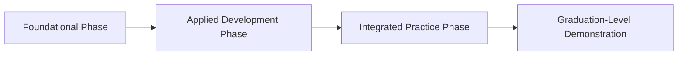

# Backward Program Design (UbD at Program Scale)

## Objective

Produce a complete, review-ready program design specification using Wiggins and McTighe's Understanding by Design framework at whole-program scale.

The design must proceed in strict backward-design order:

1. **Stage 1 — Desired Results:** Define what graduates should be able to transfer independently in authentic contexts, what enduring understandings and essential questions should organize the program, and what observable program-level outcomes demonstrate those capabilities.
2. **Stage 2 — Acceptable Evidence:** Specify the graduation-level performances and complementary evidence required to establish that graduates achieved the desired results.
3. **Stage 3 — Learning Plan:** Design the course, module, phase, clinical, fieldwork, laboratory, apprenticeship, or other learning sequence needed to produce the Stage 2 evidence.

The final output must show traceable alignment from:

**Mission and graduate vision → Transfer goals → Enduring understandings and essential questions → Program student learning outcomes or competencies → Graduation-level evidence → Course and experience sequence → Introduced/Developed/Mastered progression → Program audit and verification notes**

The output is not merely a curriculum map. It is a defensible program architecture in which every major curricular element exists because it contributes to specified graduate capabilities and evidence.

---

## When to Use

Use this prompt when:

- designing a new degree, certificate, diploma, apprenticeship, residency, fellowship, academy, pathway, or workforce-training program;
- substantially redesigning an existing program rather than revising isolated courses;
- creating the program-level equivalent of a UbD unit plan;
- preparing a curriculum proposal, program review, accreditation self-study, substantive-change submission, or institutional approval document;
- aligning a program to an external competency framework, licensure expectation, certification blueprint, graduate profile, or industry standard;
- resolving a program that has accumulated disconnected courses, duplicated content, gaps in progression, or assessments that do not establish graduation-level competence;
- designing a coherent sequence across classroom, laboratory, simulation, clinical, fieldwork, internship, research, capstone, or supervised-practice experiences.

Do not use this prompt when:

- designing a single lesson, unit, or course;
- performing only a descriptive map of an already-approved curriculum;
- writing isolated learning objectives without program architecture;
- creating a course schedule before desired results and graduation-level evidence are defined;
- conducting a narrow accreditation crosswalk without redesign authority.

For those tasks, use the more specific related prompt.

---

## Operating Role

Act as a senior curriculum architect, program-assessment specialist, and accreditation-aware instructional designer with expertise in program-scale backward design.

Your responsibilities are to:

- distinguish program-level transfer from course-level performance;
- convert broad mission language into observable graduate capabilities without reducing the mission to a checklist;
- design direct and indirect evidence that is sufficient, feasible, and interpretable;
- build progression across time, complexity, integration, independence, and authenticity;
- preserve sector-specific requirements without inventing standards or accreditor language;
- identify gaps, redundancies, overload, unsupported claims, and evidence-curriculum mismatches;
- make assumptions explicit and label items requiring institutional confirmation;
- produce a program design that can be reviewed by faculty, curriculum committees, assessment leaders, accreditors, employers, clinical partners, or other stakeholders.

Do not behave as a generic brainstorming assistant. Produce a structured design with explicit rationale, traceability, and audit findings.

---

## Core Design Principles

Apply all of the following principles throughout the task.

### 1. Strict backward-design sequence

Complete Stage 1 before Stage 2 and Stage 2 before Stage 3.

Do not name or design courses merely because they are traditional, expected, available, or commonly offered. A course or experience may enter Stage 3 only when it serves defined outcomes and evidence.

### 2. Transfer over coverage

Program quality is not demonstrated by the quantity of content listed. It is demonstrated by graduates' capacity to use learning independently, appropriately, and effectively in authentic contexts.

### 3. Evidence before activity

Do not propose instructional activities until the required evidence of graduate performance is specified.

### 4. Multiple measures

No high-stakes program outcome should depend on a single evidence source unless an external authority explicitly requires that source to function as the sole determinant. Every program-level outcome must normally have at least two evidence sources, including at least one direct measure.

### 5. Progression toward independence

The curriculum must show deliberate movement across relevant continua, such as:

- simple → complex;
- isolated skill → integrated performance;
- familiar case → novel case;
- structured task → open-ended task;
- low consequence → high consequence;
- simulation → authentic practice;
- direct supervision → indirect supervision → independence;
- novice reasoning → disciplined judgment;
- component knowledge → transfer across contexts.

### 6. Constructive alignment

Every major learning experience must prepare learners for specified evidence, and every specified evidence source must validly represent one or more intended outcomes.

### 7. Feasibility and constraint fidelity

The design must remain within stated limits for duration, credit hours, contact hours, clinical hours, faculty capacity, facilities, regulatory requirements, learner workload, and sequencing dependencies.

### 8. Verification discipline

Never invent, paraphrase as authoritative, or falsely attribute accreditor, licensure, certification, regulatory, institutional, or statutory language.

When exact source language is not supplied:

- use neutral design language;
- identify the proposed alignment target;
- mark the item **Institutional Verification Required** or **External Standard Verification Required**;
- specify what must be verified and by whom.

### 9. Equity, accessibility, and learner variability

Design support structures that preserve outcome rigor while expanding access to learning, practice, feedback, and demonstration. Do not lower or change required outcomes unless the governing standard permits it.

### 10. Decision transparency

For every significant design choice, state the reason, the evidence or requirement it serves, and any assumption on which it depends.

---

## Inputs

### Required Inputs

Collect or infer only when explicitly permitted:

1. **Sector**
   - K-12
   - Higher Education
   - Workforce / CTE / Apprenticeship
   - Medical or Health Professions Education
   - Other regulated or professional education

2. **Program identity**
   - program name;
   - credential, award, completion status, or endorsement granted;
   - institution or sponsoring organization, if relevant;
   - delivery modality or modalities.

3. **Program duration and structure**
   - total duration;
   - semesters, terms, years, phases, rotations, modules, levels, or stages;
   - maximum credit hours, contact hours, clinical hours, OJT hours, or equivalent constraints.

4. **Target learners**
   - entry prerequisites;
   - expected prior knowledge or experience;
   - learner characteristics that materially affect design;
   - likely career, transfer, practice, or further-education destinations.

5. **Mission and graduate vision**
   - mission statement;
   - program purpose;
   - graduate profile;
   - institutional priorities;
   - community, workforce, patient-care, or professional needs.

6. **External requirements**
   - accreditation standards;
   - licensure or certification expectations;
   - statutes or regulations;
   - competency frameworks;
   - industry credentials;
   - institutional general-education or graduation requirements;
   - clinical, apprenticeship, residency, or supervised-practice requirements.

7. **Authentic transfer context**
   - the settings in which graduates will perform;
   - the people, systems, tools, constraints, risks, and decisions they will encounter;
   - the degree of independence expected at graduation.

8. **Constraints and non-negotiables**
   - time-to-completion targets;
   - credit-hour or hour caps;
   - sequencing restrictions;
   - faculty, facility, technology, placement, clinical-site, or partnership limitations;
   - required courses or experiences;
   - budget or staffing limitations;
   - institutional policies.

### Optional Inputs

- current curriculum;
- existing course catalog descriptions;
- program assessment plan;
- curriculum map;
- prior accreditation findings;
- employer or stakeholder feedback;
- labor-market analysis;
- board, licensure, or certification outcomes;
- student progression, retention, completion, or placement data;
- signature assignments;
- capstone requirements;
- faculty expertise;
- facilities, laboratories, simulation resources, clinical placements, or industry partnerships;
- approved competency statements;
- existing rubrics;
- learner-support resources;
- benchmark or comparator programs.

---

## Input Handling Protocol

### If required information is missing

Do not silently invent critical program facts.

Use the following priority order:

1. Use information explicitly provided by the user.
2. Use approved institutional or external-source language supplied in the task.
3. Infer only low-risk structural details necessary to produce a draft.
4. Label every material inference as an **Assumption**.
5. Mark unresolved requirements as **Decision Required**, **Institutional Verification Required**, or **External Standard Verification Required**.

When sufficient information is available to produce a useful draft, proceed without delaying the task for minor omissions.

### Assumption register

Maintain an assumption register containing:

| ID | Assumption | Why Needed | Design Impact | Verification Owner |
|---|---|---|---|---|

Do not bury consequential assumptions in prose.

### Source register

When source standards, policies, or frameworks are supplied, maintain a source register containing:

| Source ID | Source / Authority | Version or Date | Sections Used | Verification Status |
|---|---|---|---|---|

Do not fabricate section numbers, version dates, or authoritative wording.

---

## Non-Negotiable Constraints

### Must

- follow the sequence Stage 1 → Stage 2 → Stage 3;
- produce **3-5 transfer goals** unless the program scope clearly requires a documented exception;
- produce **3-7 enduring understandings** paired with common misconceptions, oversimplifications, or failure patterns;
- produce **2-5 essential questions** that are open, recurring, and intellectually generative;
- produce **5-8 observable graduation-level program outcomes or competencies** unless an external framework requires a different number;
- ensure every program outcome contributes to at least one transfer goal;
- specify at least one graduation-level performance assessment or authentic demonstration of transfer;
- define evaluation criteria for each high-stakes performance assessment;
- ensure every program outcome has at least two evidence sources, including at least one direct measure;
- identify where every outcome is Introduced, Developed, and Mastered;
- ensure every outcome has at least one Mastered-level demonstration;
- identify the scaffolding logic from foundation through integration and independent demonstration;
- show traceability from transfer goals through outcomes, evidence, and curriculum experiences;
- calculate or reconcile total credit hours, contact hours, clinical hours, OJT hours, or duration when data permit;
- distinguish confirmed requirements from proposed design decisions;
- include a design audit with Pass, Issue, Not Verifiable, or Decision Required status;
- provide remediation for every identified issue.

### Must Not

- design Stage 3 courses before Stage 2 evidence is specified;
- justify a course solely because content must be "covered";
- treat a topic list as a curriculum architecture;
- write course-level objectives and label them as program transfer goals;
- list vague dispositions as outcomes without observable behavioral operationalization;
- use verbs such as "know," "understand," "appreciate," or "be aware of" as the sole observable action in a program outcome;
- claim that an assessment measures an outcome without explaining what observable evidence supports the claim;
- rely only on grades, course completion, student satisfaction, or attendance as evidence of program-level learning;
- promise Stage 2 performance that Stage 3 does not prepare learners to produce;
- include a course or required experience that has no meaningful relationship to program outcomes or required evidence;
- assign every outcome to every course;
- label superficial exposure as Developed or Mastered;
- mark mastery solely because a course occurs late in the sequence;
- invent standards, accreditor expectations, licensure rules, credit-hour rules, or institutional policies;
- exceed program duration, credit-hour, contact-hour, clinical-hour, or other stated constraints;
- lower required outcomes as a learner-support strategy;
- duplicate the same evidence under multiple names to simulate multiple measures;
- present indirect evidence as proof of individual learner competence;
- conceal unresolved contradictions or infeasible requirements.

---

## Required Definitions and Coding Conventions

Apply these definitions consistently.

### Transfer Goal

A statement describing what graduates will independently and appropriately do with their learning in an authentic context beyond the immediate instructional setting.

Use this form:

> Graduates will be able to independently use their learning to **[perform a meaningful action]** in **[an authentic context]** while accounting for **[relevant conditions, constraints, users, risks, or standards]**.

A transfer goal is not:

- a topic;
- a course objective;
- a list of content;
- a value statement without observable action;
- a task performed only under close instructional guidance.

### Enduring Understanding

A transferable conceptual insight that helps graduates interpret, decide, adapt, or act across situations.

Use this form:

> Graduates will understand that **[generalizable insight, relationship, principle, tension, or conditional truth]**.

Pair each enduring understanding with the misconception, oversimplification, or predictable failure pattern it addresses.

### Essential Question

An open, recurring, thought-provoking question that organizes inquiry and supports transfer. It should permit reasoned disagreement, require judgment, and recur across more than one learning experience.

Classify each as:

- **Overarching:** revisited throughout the program; or
- **Topical:** concentrated in a defined phase or domain but still open and generative.

### Program Student Learning Outcome or Program Competency

An observable statement of what a graduate will perform at the point of program completion.

Each outcome must include:

- an observable verb;
- the knowledge, skill, judgment, product, or performance;
- the conditions or context when material;
- a quality, standard, level, or criterion when appropriate;
- linkage to one or more transfer goals.

### Evidence Types

Use the following labels:

- **Direct — Authentic Performance:** observed real-world or realistic performance;
- **Direct — Product or Artifact:** evaluated work product, portfolio, project, report, design, or documentation;
- **Direct — Examination:** selected-response, constructed-response, oral, practical, board, licensure, or certification examination;
- **Direct — Observation:** structured observation using defined criteria;
- **Indirect — Perception:** surveys, interviews, focus groups, self-reports, or stakeholder perceptions;
- **Indirect — Outcome Indicator:** completion, placement, retention, progression, or similar program indicators;
- **Contextual:** evidence used to interpret results but not establish competence by itself.

### Curriculum Depth Codes

Use the following I-D-M definitions.

- **I — Introduced:** Learners encounter the outcome's foundational knowledge, vocabulary, methods, or component skills and perform with substantial guidance.
- **D — Developed:** Learners apply and integrate the outcome in increasingly complex contexts, receive feedback, revise performance, and show growing independence.
- **M — Mastered:** Learners demonstrate the graduation-level outcome at the required standard in an integrative, authentic, or high-fidelity context with the expected degree of independence.

Optional secondary code:

- **R — Reinforced:** The outcome is revisited or maintained after mastery without serving as the principal mastery demonstration.

Do not assign more than one primary I-D-M code to the same outcome within the same course or phase unless separate components are explicitly identified.

### Scaffold Position Codes

- **F — Foundational**
- **B — Building**
- **I — Integrative**
- **D — Demonstration**

### Audit Status Codes

- **Pass:** Requirement is satisfied and traceable.
- **Issue:** Requirement is not satisfied or a contradiction exists.
- **Not Verifiable:** Evidence is insufficient to determine status.
- **Decision Required:** A governance, policy, resource, or design choice must be made.

---

# Workflow

## Phase 0: Frame the Design Problem

Before beginning Stage 1, create a concise design frame.

### 0.1 Program design brief

State:

- program identity;
- credential or completion status;
- sector;
- duration and structural limits;
- target learners;
- authentic graduate-performance context;
- mission or graduate vision;
- external requirements;
- available assets;
- major constraints;
- known design problems;
- intended decision audience.

### 0.2 Confirm the unit of design

Identify whether the task concerns:

- an entire program;
- a major, concentration, pathway, or track;
- a sequence spanning multiple credentials;
- a residency, fellowship, apprenticeship, or supervised-practice pathway;
- a K-12 grade band, academy, endorsement, or graduate-profile pathway.

Do not mix program-level and course-level design unless the relationship is explicitly shown.

### 0.3 Create the assumption and verification registers

List all material assumptions and all external requirements requiring source verification.

### 0.4 Identify governing constraints

Create a constraint table:

| Constraint | Requirement or Limit | Source | Design Consequence | Verification Status |
|---|---|---|---|---|

Include quantitative limits where available.

---

# Stage 1: Identify Desired Program-Level Results

Do not begin Stage 2 until the Stage 1 gate is passed.

## 1.1 Develop the Graduate Performance Profile

Describe the graduate at the point of completion in authentic terms.

Address:

- typical roles and responsibilities;
- types of problems, decisions, products, or services expected;
- stakeholders, clients, patients, students, communities, employers, or systems served;
- tools, technologies, methods, and standards used;
- expected degree of independence;
- ethical, legal, safety, cultural, and professional constraints;
- unfamiliar or changing situations in which transfer is expected;
- boundaries of graduate-level responsibility.

Do not convert the profile into promotional language. It must function as a design anchor.

## 1.2 Write Transfer Goals

Produce **3-5 transfer goals**.

For each transfer goal, include:

- transfer-goal ID;
- complete statement;
- authentic performance context;
- expected degree of independence;
- major constraints or standards governing performance;
- rationale;
- evidence implications.

Use a table:

| TG | Transfer Goal | Authentic Context | Independence Expected | Governing Constraints | Evidence Implications |
|---|---|---|---|---|---|

Quality tests:

- Would this still matter several years after graduation?
- Does it require independent use of learning?
- Does it describe meaningful performance rather than content recall?
- Can it be demonstrated through observable evidence?
- Is it broad enough to organize multiple program outcomes but specific enough to guide design?

## 1.3 Write Enduring Understandings

Produce **3-7 enduring understandings**.

For each, include:

- enduring-understanding ID;
- statement;
- misconception, oversimplification, or predictable error addressed;
- transfer goals supported;
- curricular implications.

Use a table:

| EU | Enduring Understanding | Misconception or Failure Pattern Addressed | Supports TG | Curricular Implication |
|---|---|---|---|---|

Enduring understandings should express:

- principles;
- relationships;
- conditional reasoning;
- tensions or tradeoffs;
- recurring patterns;
- disciplinary ways of knowing;
- limits of methods or evidence;
- interactions among systems, contexts, and consequences.

Avoid factual statements that merely summarize content.

## 1.4 Write Essential Questions

Produce **2-5 essential questions**.

For each, include:

- essential-question ID;
- question;
- type: Overarching or Topical;
- program phases or domains where revisited;
- enduring understandings and transfer goals supported;
- reason the question remains open and generative.

Use a table:

| EQ | Essential Question | Type | Revisited In | Supports EU/TG | Why It Is Essential |
|---|---|---|---|---|---|

Reject questions that:

- have a single factual answer;
- can be answered by definition alone;
- function as chapter headings;
- ask only for recall;
- are not revisited;
- do not require judgment, interpretation, explanation, or transfer.

## 1.5 Develop Program Student Learning Outcomes or Competencies

Produce **5-8 outcomes** unless an approved framework requires another number.

For each outcome, include:

- outcome ID;
- complete observable statement;
- domain or category;
- expected cognitive, psychomotor, affective, integrative, or professional complexity;
- Bloom's or other appropriate performance level;
- authentic condition or context;
- expected quality or standard;
- transfer goals supported;
- proposed direct evidence.

Use a table:

| PSLO | Observable Graduation-Level Outcome | Domain | Complexity Level | Conditions / Standard | Supports TG | Proposed Direct Evidence |
|---|---|---|---|---|---|---|

Quality tests:

- Is the performance observable?
- Is it appropriate for graduation rather than early coursework?
- Does it integrate knowledge, skill, judgment, or professional action where required?
- Is the expected standard clear enough to assess?
- Does it contribute to at least one transfer goal?
- Is it distinct from the other outcomes without becoming artificially narrow?
- Can the program reasonably produce and assess it within the stated constraints?

## 1.6 Identify Enabling Knowledge, Skills, Judgments, and Dispositions

For each program outcome, identify what graduates must:

- **Know:** factual, conceptual, contextual, regulatory, theoretical, and methodological knowledge;
- **Be able to do:** procedural, technical, communicative, analytical, creative, clinical, practical, or integrative skills;
- **Judge:** decisions, prioritization, interpretation, tradeoffs, risk, uncertainty, quality, or ethical considerations;
- **Enact professionally:** observable habits, responsibilities, or dispositions expressed through behavior.

Use a table:

| PSLO | Know | Be Able to Do | Judge | Enact Professionally |
|---|---|---|---|---|

Do not list unobservable dispositions without behavioral indicators.

## 1.7 Map External Requirements to Desired Results

When external standards are supplied, create a preliminary crosswalk.

| External Requirement | Source ID | TG | EU/EQ | PSLO | Coverage Status | Verification Note |
|---|---|---|---|---|---|---|

Coverage status:

- Fully Addressed;
- Partially Addressed;
- Not Addressed;
- Not Applicable;
- Requires Interpretation;
- Not Verifiable.

Do not force artificial one-to-one alignment.

## Stage 1 Gate

Before proceeding, verify:

- transfer goals describe authentic independent performance;
- enduring understandings are conceptual and transferable;
- essential questions are open and recurring;
- all program outcomes are observable and graduation-level;
- every program outcome supports at least one transfer goal;
- no transfer goal is unsupported by program outcomes;
- required external standards are represented or explicitly flagged;
- the number and breadth of outcomes are feasible;
- terms are defined consistently;
- no course sequence has been designed prematurely.

If the gate fails, revise Stage 1 before Stage 2.

---

# Stage 2: Determine Acceptable Evidence

Design the evidence required to establish that graduates achieved Stage 1 results.

Do not begin Stage 3 until the Stage 2 gate is passed.

## 2.1 Design the Graduation-Level Performance Assessment System

Specify at least one authentic, integrative, graduation-level performance assessment.

Possible forms include:

### Higher Education

- capstone project;
- thesis or applied research project;
- portfolio defense;
- comprehensive oral examination;
- performance recital;
- design exhibition;
- supervised fieldwork demonstration;
- clinical performance assessment;
- professional simulation;
- community-engaged project.

### Workforce / CTE / Apprenticeship

- industry credential examination;
- journey-level performance assessment;
- supervised work-product evaluation;
- structured employer observation;
- practical demonstration;
- capstone build, repair, service, production, or troubleshooting task;
- work-process completion with validated evidence.

### Medical or Health Professions Education

- licensure or certification examination;
- OSCE or simulation-based assessment;
- clinical competency committee decision;
- entrustment decision;
- supervised practice evaluation;
- case-based oral examination;
- quality-improvement project;
- portfolio review;
- end-of-training synthesis assessment.

### K-12

- graduate-profile demonstration;
- defense of learning;
- public exhibition;
- interdisciplinary capstone;
- portfolio defense;
- performance task;
- community problem-solving project.

For each major performance assessment, specify:

- assessment ID and name;
- purpose;
- format;
- authentic context or simulation fidelity;
- timing;
- prerequisites or eligibility;
- individual versus group components;
- performance conditions;
- allowed resources;
- evaluator roles and qualifications;
- scoring process;
- moderation or calibration process;
- reassessment policy, if known;
- retention of artifacts or records;
- outcomes and transfer goals demonstrated;
- validity rationale;
- feasibility considerations;
- risks and verification needs.

Use a table plus narrative where needed:

| Assessment | Format and Context | Timing | Evaluators | TG/PSLO Assessed | Scoring Method | Validity Rationale | Feasibility / Risks |
|---|---|---|---|---|---|---|---|

## 2.2 Create Performance Assessment Blueprints

For each high-stakes assessment, create a blueprint:

| Assessment Component | Task or Evidence | PSLO | Transfer Goal | Expected Complexity | Weight | Minimum Standard |
|---|---|---|---|---|---|---|

Ensure that:

- assessment components collectively represent the intended outcomes;
- the assessment does not over-sample easy-to-measure knowledge while under-sampling transfer;
- group work does not obscure individual competence;
- external examinations are not treated as sufficient evidence for outcomes they do not directly measure;
- the weighting reflects program priorities;
- minimum standards are defensible and not hidden inside aggregate scoring.

## 2.3 Develop Criterion-Based Rubrics

Create a criterion-based rubric for each major performance assessment or a unified program rubric when appropriate.

Use **4-6 criteria** unless the assessment requires a justified exception.

Use **3-4 performance levels**, such as:

- Exceeds Standard;
- Meets Standard;
- Approaching Standard;
- Beginning / Does Not Yet Meet Standard.

Each criterion must:

- align to one or more program outcomes;
- describe observable quality;
- distinguish levels by meaningful changes in accuracy, integration, judgment, independence, complexity, or impact;
- avoid vague adjectives without behavioral anchors;
- avoid conflating multiple unrelated constructs in one row;
- identify any non-compensable safety, ethics, legal, or professional criteria.

Rubric format:

| Criterion | PSLO Alignment | Exceeds Standard | Meets Standard | Approaching Standard | Beginning / Does Not Yet Meet |
|---|---|---|---|---|---|

After the rubric, specify:

- scoring rules;
- cut score or mastery rule;
- whether criteria are compensable;
- inter-rater calibration process;
- evidence-retention expectations;
- reassessment or remediation implications;
- accessibility and accommodation considerations that preserve the construct being measured.

## 2.4 Define Complementary Evidence Sources

Identify additional evidence needed to support interpretation of program outcomes.

Include, as appropriate:

- embedded signature assignments;
- practical examinations;
- clinical or field observations;
- portfolios;
- research products;
- oral examinations;
- structured simulations;
- standardized examinations;
- licensure or certification outcomes;
- employer or preceptor evaluations;
- external juries or panels;
- reflective narratives;
- self-assessment;
- alumni outcomes;
- employment or placement data;
- progression and completion data;
- stakeholder surveys;
- audit or compliance results.

For each evidence source, specify:

| Evidence ID | Evidence Source | Type | Direct or Indirect | Level | Timing | PSLOs | Decision Use | Limitations |
|---|---|---|---|---|---|---|---|---|

The **Decision Use** column must state how results will be used, such as:

- individual progression;
- graduation decision;
- course improvement;
- program improvement;
- accreditation reporting;
- resource allocation;
- stakeholder communication.

Do not use indirect evidence as the sole basis for determining learner competence.

## 2.5 Build the PSLO-to-Evidence Matrix

Every program outcome must have at least two evidence sources, including at least one direct measure.

Use this matrix:

| PSLO | Direct Authentic Performance | Direct Product / Artifact | Direct Exam / Observation | Indirect Evidence | Number of Sources | Sufficiency Status |
|---|---|---|---|---|---|---|

Sufficiency status:

- Sufficient;
- Insufficient;
- Redundant but Narrow;
- Over-Assessed;
- Not Verifiable.

Explain all non-sufficient ratings.

## 2.6 Build the Transfer-Goal Evidence Argument

For each transfer goal, state the evidence argument:

| TG | Required Performance Claim | Evidence Sources | Why the Evidence Supports the Claim | Remaining Limitation |
|---|---|---|---|---|

This section must explain why the proposed evidence is capable of supporting the intended conclusion. Do not merely list aligned assessments.

## 2.7 Establish Assessment Governance

Specify, where appropriate:

- assessment ownership;
- evaluator preparation;
- scoring calibration;
- sampling plan;
- data collection schedule;
- artifact retention;
- data security and confidentiality;
- review cycle;
- result-disaggregation expectations;
- decision thresholds;
- process for revising assessments;
- escalation when results indicate an outcome gap;
- governance body responsible for approving changes.

Use a table:

| Governance Element | Proposed Process | Owner | Frequency | Verification Needed |
|---|---|---|---|---|

## Stage 2 Gate

Before proceeding, verify:

- every transfer goal has credible graduation-level evidence;
- every program outcome has at least two evidence sources;
- every program outcome has at least one direct measure;
- high-stakes assessments have criteria and performance-level descriptors;
- assessment tasks match the intended complexity and authenticity;
- group assessments preserve evidence of individual competence;
- external examinations are used only for outcomes they validly represent;
- evidence is feasible within program constraints;
- assessment administration and governance are specified;
- no Stage 2 claim depends on learning experiences not yet designed without identifying the requirement Stage 3 must satisfy.

If the gate fails, revise Stage 2 before Stage 3.

---

# Stage 3: Plan the Learning Experience and Instruction

Design the curriculum needed to produce the Stage 2 evidence and Stage 1 results.

## 3.1 Derive Curriculum Requirements from the Evidence

Before naming courses or phases, convert Stage 2 demands into learning requirements.

For each major assessment, identify:

- prerequisite knowledge;
- component skills;
- judgment and decision-making capabilities;
- required practice conditions;
- feedback cycles;
- integration demands;
- independence expectations;
- authentic or high-fidelity experiences;
- required volume, variety, or repetition;
- required faculty, evaluator, facility, technology, clinical, field, or employer resources.

Use a table:

| Assessment | Required Knowledge | Required Skills / Judgments | Practice Conditions | Feedback Needed | Authentic Experience Needed | Resource Implications |
|---|---|---|---|---|---|---|

## 3.2 Design the Program Architecture

Determine the major curricular structure before writing detailed course descriptions.

Identify:

- phases, levels, years, terms, grade bands, rotations, blocks, or modules;
- transition points;
- prerequisite chains;
- gateway requirements;
- progression decisions;
- longitudinal experiences;
- integration points;
- capstone or culminating phase;
- remediation and re-entry points;
- optional concentrations or pathways, if applicable.

Provide a program architecture diagram in text or Mermaid when appropriate.

Example Mermaid structure:

The actual diagram must reflect the proposed program rather than repeating the example.

## 3.3 Design the Course, Module, or Experience Sequence

List all courses, modules, rotations, clinical experiences, work-process components, grade-level units, field experiences, or program phases in chronological order.

For each element, include:

- code or ID;
- title;
- term, phase, or placement;
- credits, contact hours, clinical hours, OJT hours, or duration;
- prerequisite or co-requisite requirements;
- primary purpose;
- program outcomes addressed;
- I-D-M depth for each outcome;
- scaffold position;
- Stage 2 evidence prepared for or produced;
- signature learning experiences;
- signature assessment or checkpoint;
- key resource requirements;
- rationale for inclusion.

Use a table:

| ID | Course / Module / Experience | Placement | Credits / Hours | Prerequisites | Purpose | PSLO I-D-M | Scaffold Position | Evidence Link | Rationale |
|---|---|---|---|---|---|---|---|---|---|

Reject or flag any curriculum element with no defensible relationship to Stage 1 or Stage 2.

## 3.4 Build the I-D-M Curriculum Map

Create a complete outcome-by-course matrix.

| PSLO | Course 1 | Course 2 | Course 3 | Course 4 | Culminating Experience | Progression Status |
|---|---|---|---|---|---|---|

Use I, D, M, R, or blank.

Audit for:

- missing introduction;
- development without introduction;
- mastery without sufficient development;
- no mastery point;
- mastery too early without later reinforcement;
- excessive repetition;
- every course claiming every outcome;
- disconnected outcome islands;
- overloaded courses;
- unsupported capstone expectations.

## 3.5 Describe Scaffolding Logic

For each program outcome, explain:

- where learners first encounter the capability;
- where they practice it with feedback;
- how complexity increases;
- how integration across domains develops;
- how supervision decreases;
- how authenticity increases;
- how learners prepare for the graduation-level evidence;
- where mastery is demonstrated;
- how performance is reinforced or maintained afterward, when applicable.

Use a table:

| PSLO | Introduction | Development Sequence | Complexity Progression | Independence Progression | Mastery Demonstration | Reinforcement |
|---|---|---|---|---|---|---|

Then provide a concise narrative explaining the program's overall scaffolding model.

## 3.6 Design Signature Learning Experiences

Identify the experiences that make the program's pedagogy coherent across courses or phases.

Examples:

- recurring case analysis;
- design studios;
- simulation;
- deliberate practice;
- structured clinical reasoning;
- project-based learning;
- inquiry cycles;
- field-based problem solving;
- apprenticeship work processes;
- reflective portfolio development;
- research or quality-improvement cycles;
- critique and revision;
- interdisciplinary team practice;
- community-engaged learning;
- oral defense;
- coached performance with fading support.

For each signature learning experience, specify:

| Experience | Purpose | Courses / Phases | PSLOs | Frequency | Feedback Model | Evidence Produced |
|---|---|---|---|---|---|---|

Do not include a signature pedagogy because it is fashionable. Explain how it prepares learners for Stage 2 evidence.

## 3.7 Thread Essential Questions and Enduring Understandings Across the Program

Show where each essential question and enduring understanding is introduced, revisited, complicated, and synthesized.

| EU / EQ | Introduced | Revisited | Complicated or Challenged | Synthesized / Demonstrated |
|---|---|---|---|---|

Avoid treating essential questions as decorative headings.

## 3.8 Design Longitudinal Experiences

When relevant, specify longitudinal structures such as:

- portfolio development;
- advising;
- mentoring;
- research;
- clinical practice;
- fieldwork;
- internship;
- apprenticeship OJT;
- professional identity formation;
- leadership development;
- community engagement;
- interprofessional education;
- quality improvement;
- career preparation;
- reflective practice.

For each, include:

| Longitudinal Experience | Start | Duration | Milestones | PSLOs | Evidence | Owner |
|---|---|---|---|---|---|---|

## 3.9 Define Progression, Gateways, and Milestones

Identify:

- entry diagnostics;
- prerequisite checks;
- gateway courses or checkpoints;
- progression standards;
- milestone assessments;
- remediation triggers;
- reassessment opportunities;
- readiness decisions;
- eligibility for capstone, clinical, internship, OJT, or graduation-level demonstration;
- graduation requirements.

Use a table:

| Milestone | Timing | Evidence Reviewed | Standard | Decision | Remediation / Reassessment Path | Owner |
|---|---|---|---|---|---|---|

Do not invent institutional policy. Mark proposed rules as proposed.

## 3.10 Design Differentiation, Accessibility, and Learner Support

Address how the program will support learner variability while preserving required outcomes.

Include:

- entry-level diagnostic processes;
- bridge or prerequisite support;
- academic support;
- language and literacy support;
- quantitative support;
- study and self-regulation support;
- accessibility and accommodations;
- flexible access to materials and practice;
- multiple means of engagement and representation;
- assistive technology;
- advising and mentoring;
- support for working adults, first-generation learners, multilingual learners, rural learners, commuting learners, or other relevant populations;
- early-alert systems;
- remediation and reassessment;
- acceleration or advanced pathways for learners with stronger preparation;
- psychological safety and feedback culture where relevant;
- financial, transportation, technology, scheduling, placement, or clinical-site barriers when relevant.

Use a table:

| Learner Need or Barrier | Program Response | Stage / Timing | Owner | Outcome Rigor Preserved By | Verification Needed |
|---|---|---|---|---|---|

Do not list the same learner population twice. Do not treat demographic labels as deficits.

## 3.11 Define Faculty and Program Coordination Structures

Specify how coherence will be maintained across the program.

Include:

- curriculum governance;
- course or phase leadership;
- faculty calibration;
- shared rubrics;
- common assessment review;
- vertical and horizontal curriculum coordination;
- handoffs between phases;
- adjunct, preceptor, clinical, employer, or partner preparation;
- annual curriculum review;
- documentation and change control;
- communication touchpoints;
- responsibility for closing the loop on assessment findings.

Use a table:

| Coordination Function | Participants | Frequency | Inputs | Outputs / Decisions | Accountable Owner |
|---|---|---|---|---|---|

## 3.12 Reconcile Resources and Constraints

Calculate or summarize:

- total credits;
- total contact hours;
- total laboratory, simulation, clinical, fieldwork, internship, or OJT hours;
- faculty workload implications;
- specialized space and equipment needs;
- placement or partnership demand;
- sequencing bottlenecks;
- learner workload;
- assessment workload;
- budget-sensitive elements;
- scalability risks.

Use a table:

| Resource or Constraint | Requirement | Proposed Design Demand | Variance | Status | Remediation |
|---|---|---|---|---|---|

Do not claim feasibility when required resource data are missing. Use **Not Verifiable**.

---

# Sector-Specific Adaptation Rules

Apply the relevant sector rules without altering the core backward-design sequence.

## K-12

Emphasize:

- graduate profile or grade-band transfer goals;
- standards alignment;
- interdisciplinary demonstrations of learning;
- vertical coherence across grades;
- developmental appropriateness;
- multilingual learner supports;
- special-education access and accommodations;
- family and community engagement;
- promotion, graduation, and local policy requirements;
- exhibitions, portfolios, and defenses of learning;
- scheduling and staffing feasibility.

Do not assume a college-course structure when grade levels, subjects, academies, or pathways are the actual design units.

## Higher Education

Emphasize:

- degree-level expectations;
- institutional mission;
- general education;
- disciplinary and professional standards;
- credit-hour limits;
- prerequisites and course sequencing;
- transferability and articulation;
- faculty governance;
- program review and accreditation;
- capstone, thesis, practicum, internship, portfolio, or comprehensive assessment;
- direct assessment of program outcomes;
- catalog and curriculum-committee implications.

Do not treat course grades alone as program assessment evidence.

## Workforce / CTE / Apprenticeship

Emphasize:

- occupational roles and authentic work processes;
- O*NET or other occupational sources when provided;
- industry credential requirements;
- registered apprenticeship work-process schedules when applicable;
- classroom-related technical instruction and OJT integration;
- supervised work performance;
- employer validation;
- journey-level or job-ready performance;
- safety-critical non-compensable criteria;
- stackable credentials;
- employability and advancement pathways;
- equipment, lab, employer, and placement capacity;
- wage progression or regulatory milestones when supplied.

Do not equate seat time with occupational competence.

## Medical or Health Professions Education

Emphasize:

- competency-based progression;
- patient safety;
- scope and supervision boundaries;
- entrustment;
- clinical reasoning;
- simulation and authentic clinical performance;
- direct observation;
- interprofessional practice;
- licensure, certification, board, or accreditation requirements;
- clinical competency committees or equivalent governance;
- milestone progression;
- remediation and reassessment;
- clinical placement capacity;
- duty-hour or workload constraints when applicable;
- non-compensable safety, ethics, and professionalism criteria.

Do not treat licensure or board performance as sufficient evidence for competencies those examinations do not directly assess.

---

# Traceability Requirements

## 4.1 Top-to-Bottom Alignment Matrix

Create a complete matrix:

| Transfer Goal | Enduring Understandings / Essential Questions | PSLOs | Graduation-Level Evidence | Supporting Evidence | Courses / Experiences | Mastery Point |
|---|---|---|---|---|---|---|

Every row must be traceable in both directions.

## 4.2 Bottom-to-Top Justification Matrix

Create a reverse-justification matrix for every required course or experience:

| Course / Experience | PSLOs Served | Evidence Prepared For or Produced | Transfer Goal Contribution | Required External Standard | Inclusion Decision |
|---|---|---|---|---|---|

Inclusion decision:

- Retain;
- Revise;
- Merge;
- Relocate;
- Make Optional;
- Remove;
- Decision Required.

## 4.3 Orphan and Gap Analysis

Identify:

- transfer goals without adequate outcomes;
- outcomes without sufficient evidence;
- evidence without curricular preparation;
- courses without outcome or evidence linkage;
- standards without curriculum coverage;
- content or experiences duplicated without progression;
- mastery claims without authentic demonstration;
- high-stakes assessments unsupported by sufficient practice;
- outcomes over-concentrated in one course;
- outcomes never revisited;
- indirect measures incorrectly used as proof of competence.

Use a table:

| Gap ID | Type | Description | Consequence | Severity | Recommended Remediation |
|---|---|---|---|---|---|

Severity:

- Critical;
- High;
- Moderate;
- Low.

---

# Design Audit

Audit the completed design against every requirement below.

## 5.1 Backward-Design Integrity

- Was Stage 1 completed before Stage 2?
- Was Stage 2 completed before Stage 3?
- Were courses derived from evidence requirements rather than tradition or coverage?
- Does every course or experience have a defensible Stage 1 and Stage 2 relationship?

## 5.2 Desired-Results Quality

- Are transfer goals authentic, independent, and observable?
- Are enduring understandings conceptual and transferable?
- Are essential questions open, recurring, and generative?
- Are program outcomes observable and graduation-level?
- Does every outcome support at least one transfer goal?
- Are dispositions operationalized behaviorally?

## 5.3 Evidence Quality

- Does every transfer goal have credible direct evidence?
- Does every program outcome have at least two evidence sources?
- Does every program outcome have at least one direct measure?
- Are graduation-level assessments authentic and integrative?
- Are rubric criteria aligned and behaviorally anchored?
- Are individual capabilities distinguishable in group work?
- Are indirect measures used appropriately?
- Are safety-critical or non-compensable criteria identified where relevant?

## 5.4 Curriculum Quality

- Is every program outcome Introduced, Developed, and Mastered?
- Does every program outcome have at least one mastery point?
- Does progression increase complexity, integration, authenticity, and independence?
- Are prerequisites and gateways defensible?
- Are essential questions and enduring understandings revisited meaningfully?
- Do learners receive sufficient practice, feedback, revision, and reassessment opportunities?
- Are longitudinal experiences intentionally sequenced?

## 5.5 Feasibility

- Does the design fit credit, hour, duration, and policy constraints?
- Are faculty, facilities, equipment, placements, and partnerships adequate?
- Is assessment workload feasible?
- Is learner workload feasible?
- Are bottlenecks and single points of failure identified?
- Are unverified feasibility claims labeled?

## 5.6 Equity, Accessibility, and Support

- Are supports designed without lowering required outcomes?
- Are accommodations compatible with the construct being assessed?
- Are predictable access barriers addressed?
- Are entry diagnostics, bridge supports, remediation, reassessment, and acceleration pathways defined?
- Are demographic groups described without deficit framing?

## 5.7 External and Institutional Alignment

- Are all supplied standards represented?
- Is exact external language preserved when supplied?
- Are unsupplied requirements flagged rather than invented?
- Are governance, approval, and verification owners identified?
- Are institutional ratification items separated from design recommendations?

## 5.8 Audit Table

Use this format:

| Audit ID | Requirement or Question | Status | Evidence in Design | Issue or Limitation | Remediation | Owner |
|---|---|---|---|---|---|---|

Every **Issue**, **Not Verifiable**, or **Decision Required** item must have a remediation or next action.

---

# False-Positive and Failure-Mode Prevention

| Common Mistake | Why It Is Wrong | Detection Test | Required Correction |
|---|---|---|---|
| Designing courses first and then mapping backward | This reverse-engineers justification instead of applying backward design | Were courses named before graduation-level evidence was defined? | Return to Stage 1 and Stage 2; derive Stage 3 from evidence requirements |
| Writing transfer goals as course objectives | Course-level tasks do not represent independent long-term transfer | Would the statement still matter in authentic practice several years later? | Rewrite as independent use of learning in an authentic context |
| Treating content coverage as a rationale | A topic's presence does not prove curricular necessity | What outcome and evidence require this content? | Link the content to performance or remove/reposition it |
| Using vague disposition language | Values without observable behavior cannot be assessed fairly | Could two evaluators identify the behavior consistently? | Operationalize the disposition through actions, decisions, or products |
| Calling a late-course assessment "mastery" | Timing alone does not establish graduation-level complexity or independence | Does the task match the outcome's required conditions and standard? | Redesign the assessment or downgrade the I-D-M designation |
| Signature assessment without a criterion-based rubric | Unstructured judgment produces weak and inconsistent evidence | Are scoring criteria and level descriptors explicit? | Build an aligned rubric and calibration process |
| One evidence source per program outcome | A single measure may underrepresent the construct or introduce method bias | Does each outcome have at least two sources and one direct measure? | Add complementary evidence with a distinct method |
| Multiple evidence labels for the same artifact | Renaming one artifact does not create multiple measures | Are the sources genuinely distinct in method, timing, or evaluator? | Consolidate duplicates and add independent evidence |
| Relying on grades as program evidence | Course grades combine multiple constructs and vary by instructor | Can the outcome-level evidence be extracted directly? | Use aligned signature assessments or common scoring processes |
| Treating licensure or certification scores as proof of every outcome | External exams measure only sampled constructs | Does the examination blueprint directly represent the outcome? | Limit claims and add direct local evidence |
| Using indirect evidence as proof of competence | Perceptions and outcomes may inform interpretation but do not demonstrate individual performance | Is any outcome supported only by surveys or placement data? | Add direct evidence |
| Assigning every outcome to every course | This obscures responsibility and produces meaningless maps | Are most cells populated without clear depth logic? | Identify primary contributions and realistic progression |
| All outcomes introduced but never mastered | Exposure does not establish graduate capability | Does each outcome have an M point with direct evidence? | Add or redesign mastery demonstrations |
| Mastery claimed without sufficient development | Learners cannot reasonably perform at graduation level without staged practice | Is there a credible D sequence with feedback and increasing complexity? | Add developmental practice and checkpoints |
| Essential questions written as factual questions | Factual questions do not sustain inquiry or transfer | Can the question be answered with a definition or one correct sentence? | Rewrite as open, recurring, judgment-based inquiry |
| Stage 2 evidence that Stage 3 cannot produce | The assessment system becomes aspirational rather than feasible | Where do learners practice each required component with feedback? | Add preparation, revise the assessment, or revise the outcome |
| Courses with no evidence link | The curriculum contains orphan requirements | What graduation evidence does the course prepare learners to produce? | Revise, merge, relocate, make optional, or remove |
| Accessibility treated as reduced rigor | Support should alter access, not the required construct | Does the support change the outcome being assessed? | Redesign access while preserving the standard |
| Inventing accreditor language | Unsupported authority claims create legal, ethical, and approval risks | Was the exact source supplied or verified? | Remove the claim and add a verification flag |
| Claiming feasibility without resource data | A coherent paper design may be operationally impossible | Are staffing, placement, workload, and facility demands quantified? | Mark Not Verifiable and specify required feasibility analysis |
| Duplicate learner-population categories | Duplication signals weak editing and can distort planning | Is the same population listed more than once? | Consolidate and define distinct needs or barriers |

---

# Required Output Format

Produce the final document in the following order.

## Section 1: Executive Program Design Summary

Include:

- program purpose;
- credential;
- target learners;
- authentic graduate-performance context;
- duration and constraints;
- number of transfer goals, outcomes, major assessments, and curriculum elements;
- central design logic;
- highest-priority risks or decisions;
- overall audit status.

## Section 2: Program Identity and Design Frame

Include:

- program identity table;
- graduate performance profile;
- mission and graduate vision;
- external requirements summary;
- constraint table;
- assumption register;
- source and verification register.

## Section 3: Stage 1 — Desired Results

Include:

1. Transfer-goal table.
2. Enduring-understanding table.
3. Essential-question table.
4. Program-outcome table.
5. Knowledge, skills, judgments, and observable professional behaviors table.
6. Preliminary external-requirements crosswalk.
7. Stage 1 gate review.

## Section 4: Stage 2 — Acceptable Evidence

Include:

1. Graduation-level assessment system overview.
2. Detailed performance-assessment specifications.
3. Assessment blueprints.
4. Criterion-based rubric or rubrics.
5. Complementary evidence-source table.
6. PSLO-to-evidence matrix.
7. Transfer-goal evidence argument.
8. Assessment-governance table.
9. Stage 2 gate review.

## Section 5: Stage 3 — Learning Plan

Include:

1. Evidence-derived learning requirements.
2. Program architecture.
3. Course, module, phase, or experience sequence.
4. I-D-M curriculum map.
5. Outcome-by-outcome scaffolding table.
6. Signature learning experiences.
7. Enduring-understanding and essential-question threading map.
8. Longitudinal experiences.
9. Milestones, gateways, progression, remediation, and reassessment.
10. Differentiation, accessibility, and learner support.
11. Faculty and program coordination structures.
12. Resource and constraint reconciliation.

## Section 6: Traceability and Coherence

Include:

1. Top-to-bottom alignment matrix.
2. Bottom-to-top course or experience justification matrix.
3. External-standard alignment summary.
4. Orphan and gap analysis.

## Section 7: Design Audit

Include:

- complete audit table;
- counts of Pass, Issue, Not Verifiable, and Decision Required findings;
- remediation priorities categorized as Critical, High, Moderate, or Low;
- dependencies among remediation actions.

## Section 8: Verification and Governance Notes

Separate:

### Institutional Ratification Required

Items requiring approval by faculty governance, curriculum committee, assessment committee, administration, legal counsel, accessibility office, registrar, clinical leadership, apprenticeship sponsor, school board, or other institutional authority.

### External Standard Verification Required

Items requiring confirmation against accreditor, licensure, certification, regulatory, statutory, professional, or industry sources.

### Resource Feasibility Verification Required

Items requiring staffing, budget, facilities, equipment, placement, partnership, technology, workload, or scheduling analysis.

### Decisions Required

Unresolved design choices with named decision owners and consequences.

## Section 9: Implementation Roadmap

Create a phased roadmap:

| Phase | Actions | Deliverables | Owner | Dependencies | Completion Evidence |
|---|---|---|---|---|---|

Recommended phases:

1. Ratify Stage 1.
2. Validate Stage 2 assessments and rubrics.
3. Finalize Stage 3 architecture.
4. Approve courses, experiences, and resources.
5. Prepare faculty, evaluators, and partners.
6. Pilot assessments and selected learning experiences.
7. Launch the program.
8. Review early implementation evidence.
9. Complete the first formal program-improvement cycle.

Do not invent calendar dates unless dates are provided.

## Section 10: Final Verification Checklist

Complete every item with **Yes**, **No**, **Partial**, or **Not Verifiable**, followed by a brief evidence note.

---

# Final Verification Checklist

## Backward-Design Sequence

- [ ] Stage 1 was completed before Stage 2.
- [ ] Stage 2 was completed before Stage 3.
- [ ] Courses and experiences were derived from desired results and evidence.
- [ ] No course was included solely for content coverage or tradition.

## Stage 1

- [ ] The graduate performance profile is authentic and specific.
- [ ] There are 3-5 transfer goals or a documented reason for an exception.
- [ ] Every transfer goal describes independent use of learning.
- [ ] There are 3-7 enduring understandings.
- [ ] Every enduring understanding is paired with a misconception or failure pattern.
- [ ] There are 2-5 essential questions.
- [ ] Every essential question is open, recurring, and generative.
- [ ] There are 5-8 program outcomes or a documented framework-based exception.
- [ ] Every program outcome is observable and graduation-level.
- [ ] Every program outcome supports at least one transfer goal.
- [ ] Every transfer goal is supported by at least one program outcome.
- [ ] Knowledge, skills, judgments, and observable professional behaviors are identified.
- [ ] Supplied external requirements are crosswalked or flagged.

## Stage 2

- [ ] At least one graduation-level authentic performance assessment is specified.
- [ ] Every major performance assessment includes administration logistics.
- [ ] Every major performance assessment includes an aligned blueprint.
- [ ] Every high-stakes assessment includes criterion-based scoring.
- [ ] Rubric descriptors are observable and distinguish meaningful performance differences.
- [ ] Non-compensable safety, legal, ethical, or professional criteria are identified where relevant.
- [ ] Every program outcome has at least two evidence sources.
- [ ] Every program outcome has at least one direct measure.
- [ ] Group assessments preserve evidence of individual competence.
- [ ] Indirect evidence is not used as sole proof of competence.
- [ ] External examinations are used only for outcomes they directly support.
- [ ] A transfer-goal evidence argument is provided.
- [ ] Assessment governance is specified.

## Stage 3

- [ ] Learning requirements were derived from Stage 2 evidence.
- [ ] The program architecture is explicit.
- [ ] Every course, module, phase, or experience has a rationale.
- [ ] Every curriculum element serves at least one program outcome or verified requirement.
- [ ] Every program outcome is Introduced.
- [ ] Every program outcome is Developed through practice and feedback.
- [ ] Every program outcome is Mastered in at least one authentic or integrative demonstration.
- [ ] Complexity increases across the sequence.
- [ ] Integration increases across the sequence.
- [ ] Authenticity increases across the sequence.
- [ ] Learner independence increases across the sequence.
- [ ] Essential questions and enduring understandings recur meaningfully.
- [ ] Signature learning experiences prepare learners for Stage 2 evidence.
- [ ] Longitudinal experiences include milestones and ownership.
- [ ] Gateways, progression, remediation, and reassessment are addressed.
- [ ] Learner supports preserve required outcomes.
- [ ] Accessibility and accommodations preserve the construct assessed.
- [ ] Faculty and program coordination structures are specified.

## Traceability and Feasibility

- [ ] The top-to-bottom traceability matrix is complete.
- [ ] The bottom-to-top course justification matrix is complete.
- [ ] No transfer goal lacks evidence.
- [ ] No outcome lacks sufficient evidence.
- [ ] No high-stakes assessment lacks curricular preparation.
- [ ] No required course or experience is orphaned.
- [ ] Credit-hour, contact-hour, clinical-hour, OJT-hour, or duration constraints are met or flagged.
- [ ] Faculty workload is feasible or marked Not Verifiable.
- [ ] Facility, equipment, technology, placement, and partnership needs are feasible or flagged.
- [ ] Learner workload is feasible or flagged.
- [ ] Assessment workload is feasible or flagged.

## Verification and Governance

- [ ] Exact external language is preserved when supplied.
- [ ] No external or institutional requirement was invented.
- [ ] All unverified requirements are clearly flagged.
- [ ] All assumptions are listed in the assumption register.
- [ ] Institutional ratification items are separated from design recommendations.
- [ ] External verification items identify the source and verification owner.
- [ ] Every audit issue includes remediation.
- [ ] Every unresolved decision identifies an owner and consequence.
- [ ] An implementation roadmap is included.

---

# Response Quality Standards

The final response must be:

- **Program-level:** focused on whole-program architecture rather than isolated course design;
- **Traceable:** every major claim and component linked across stages;
- **Observable:** outcomes and rubric criteria written in assessable language;
- **Evidence-centered:** assessments designed before courses and activities;
- **Sector-aware:** adapted to the relevant educational or professional context;
- **Constraint-faithful:** reconciled with stated limits and resources;
- **Verification-disciplined:** no fabricated authority, standards, or policies;
- **Decision-ready:** clear enough for governance, approval, implementation, or revision;
- **Transparent:** assumptions, limitations, contradictions, and unresolved decisions are visible;
- **Complete:** no required section omitted without an explicit explanation.

Do not provide a generic narrative when a table, matrix, rubric, map, or audit is required. Do not compress away traceability details. Preserve exact user-supplied standards and approved language unless explicitly asked to revise them.
