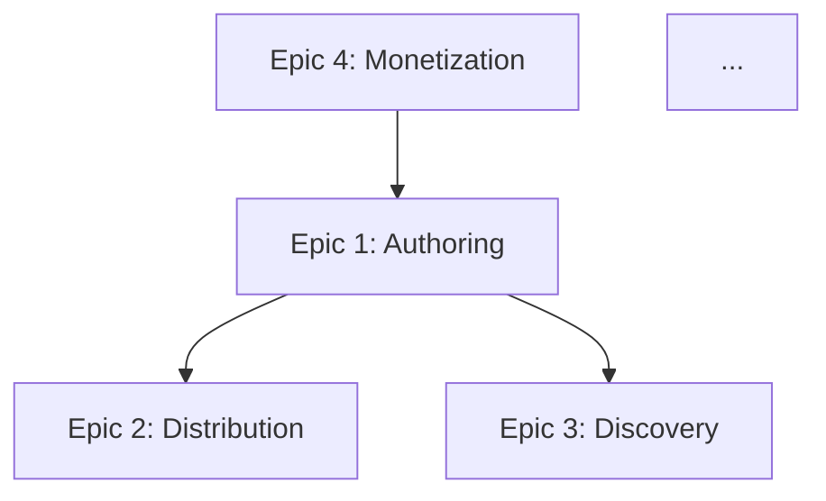

# PRD-to-Epic/Feature Decomposer (with MVP/V1/V2 Cut Lines)

**Objective:** Convert a complete PRD into a hierarchical decomposition (epic → feature → user story) with dependency edges and three explicit scope tiers (MVP / V1 / V2). Output is the structural bridge between product spec and architecture design, and the input to AI-agent task generation in stage 10.

## When to Use

- Stage 7 PRD exists and has passed `product_rigorous_prd_evaluation_and_scoring`.
- You're about to do architecture (stage 8) and need feature-level granularity to pick a stack.
- You need a clear MVP boundary to scope the first build phase.

## Inputs

The user must provide:
1. **The PRD** (paste full text or link).
2. **Hard constraints** that bound MVP scope: launch deadline, team size, capital runway, any regulatory cutoffs.
3. **Stated MVP hypothesis from the PRD** (the single thing the MVP must prove).

If the PRD lacks an MVP hypothesis, stop and ask the user to define it. Do not decompose without it.

## Constraints

**Must:**
- Produce three layers: epics (3-7), features (3-8 per epic), user stories (2-5 per feature).
- Every user story in "As a [user], I want [outcome], so that [value]" form.
- Every feature carries an explicit list of dependencies (other features) and an estimated complexity (S/M/L/XL).
- Produce a Mermaid `graph TD` of the epic-level dependency graph.
- Produce three scope tiers: **MVP** (minimum to test the MVP hypothesis), **V1** (the version you'd announce publicly), **V2** (next 90 days post-launch). Each tier must include exact feature counts and the rationale for what's IN vs. OUT.
- Identify any features that LOOK optional but are actually load-bearing for the MVP hypothesis (and explain why).
- Flag features that depend on external systems (auth, payments, email, etc.) so they get build-vs-buy decisions at stage 8.

**Must Not:**
- Inflate MVP scope. If the MVP tier has >8 features, the hypothesis is probably too broad; flag it and ask the user to narrow.
- Use vague feature names like "User Management" — every feature must describe an outcome the user can observe.
- Omit dependencies because they're inconvenient. Dependency edges are the most important output.
- Pre-decide architecture (don't say "implemented as a microservice" — that's stage 8).

## Instructions

### Step 1: Read the PRD; extract the MVP hypothesis
State the MVP hypothesis verbatim from the PRD. If absent, halt and ask.

### Step 2: Extract epics (3-7)
An epic is a coherent area of user value (e.g., "Authoring," "Discovery," "Monetization"). Not a technical layer.

### Step 3: For each epic, list features (3-8 each)
A feature is something a user can observe and describe ("Reader can clip a quote and share it with attribution"). Not "BackendAPI."

### Step 4: For each feature, list user stories (2-5 each)
Standard form. Each story must have observable acceptance from a user perspective.

### Step 5: Build dependency edges
For each feature, list which features (by name) must exist for it to function. Build the graph.

### Step 6: Estimate complexity
S = 1-2 days agent work / 1 sprint human. M = 1 week / 2 sprints. L = 2-3 weeks / 1 month. XL = decompose further before estimating.

### Step 7: Cut lines (MVP / V1 / V2)
- **MVP:** the smallest set that lets you test the MVP hypothesis with real users.
- **V1:** what you can announce publicly (adds polish, table-stakes features, basic monetization).
- **V2:** the 90-day post-launch backlog.
For each feature, assign tier and 1-sentence rationale.

### Step 8: Cross-check
- Does the MVP set close the dependency graph (no MVP feature depends on a V1+ feature)?
- Does the MVP actually test the hypothesis end-to-end?
- Are there features the user emotionally wants in MVP but that don't affect the hypothesis? Move them to V1 and explain.

## Output Format

```
## PRD Decomposition: [product name]

### MVP Hypothesis (verbatim from PRD)
> [quote]

### Epic-Level Dependency Graph


### Epic / Feature / Story Table

#### Epic 1: [Name]
| Feature | Stories | Deps | Complexity | Tier | Rationale |
|---------|---------|------|-----------|------|-----------|
| 1.1 Reader can clip a quote | (3 stories) | — | M | MVP | Tests core hypothesis: do readers share? |
| 1.2 Author can edit clip | (2 stories) | 1.1 | S | V1 | Polish; not needed for hypothesis |
| ... | | | | | |

[repeat for each epic]

### Scope Tiers
**MVP (count = N):** [list features]. **Rationale:** [why this set is sufficient and necessary to test the hypothesis].
**V1 (count = N):** [list]. **Rationale:** [what makes this announcement-ready].
**V2 (count = N):** [list]. **Rationale:** [post-launch priorities].

### External-system features (flag for stage 8 build-vs-buy)
- [Feature X] — depends on auth provider
- [Feature Y] — depends on payments
- ...

### Load-bearing-but-non-obvious MVP features
- [Feature Z] — looks like nice-to-have but is required because [reason]

### Open questions for the user before stage 8
1. ...
2. ...
```

## Verification

- [ ] MVP hypothesis quoted verbatim
- [ ] 3-7 epics, 3-8 features each, 2-5 stories each
- [ ] Every feature has dependency list + complexity + tier + rationale
- [ ] Mermaid graph compiles (epic-level only — feature graph is too dense)
- [ ] MVP feature count ≤ 8; if larger, halted with hypothesis-too-broad flag
- [ ] MVP dependency closure verified (no MVP feature depends on V1+ feature)
- [ ] External-system features flagged

## False-Positive Prevention

- **Scope creep masked as "must-have."** When a stakeholder argues every feature is MVP, force the question: "If this feature is missing on launch day, does the MVP hypothesis still get tested?" If yes → not MVP.
- **Hidden dependencies.** A "Discovery" feature that silently depends on "Tagging" which is V1 will block MVP. Trace each dependency chain to V1+ explicitly.
- **Stack assumptions in the wrong place.** "Real-time updates" is a feature property, not a feature itself. Capture it as an NFR on the relevant feature; don't make it its own item.
- **Epic count inflation.** If you have 10+ epics, you're at the wrong level — those are probably features under broader epics.
- **User stories that don't have an observable user outcome.** "As a developer, I want a REST API" is wrong (developer is not the user of the product). Drop or rephrase.
