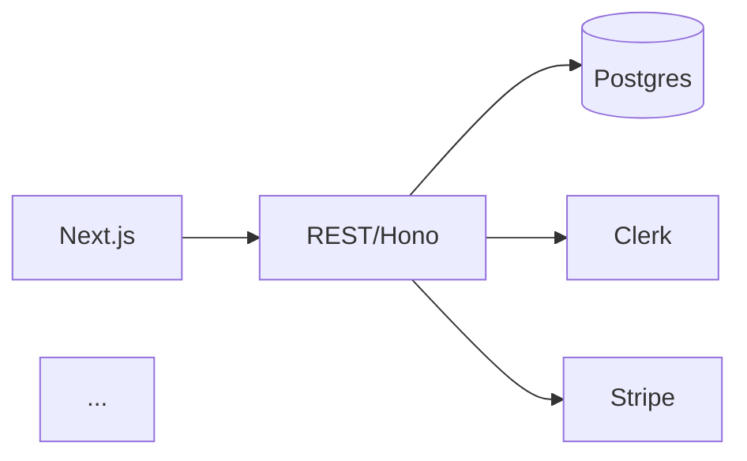

# Tech Stack Selector (Component Decision Matrix, AI-Agent-Friendly)

**Objective:** Convert the decomposed feature set into a concrete stack of technology choices, one decision per architectural component. For each component, evaluate 2-4 candidates against a fixed criteria set, pick a winner, log rejected alternatives, and explicitly score AI-coding-agent friendliness (training-data density, idiom stability, error-message clarity, ecosystem maturity). Output: stack decision document ready to feed into stage 10 (AI-agent handoff).

## When to Use

- Stages 7 (PRD) and 7-decomposer (epic/feature tree) are complete.
- You're choosing tech stack for a from-scratch build that an AI coding agent (Claude Code / Cursor) will execute.
- You want to avoid the two failure modes: (a) "use what we know" without checking fit, and (b) "use the trendy thing" without checking AI-agent compatibility.

## Inputs

The user must provide:
1. **Epic/feature tree** from stage 7 decomposer.
2. **External-system flags** from the decomposer (auth, payments, email, etc.).
3. **Team context:** team size, AI-agent vs. human-engineer ratio, languages the team/agent has the most reps in.
4. **Constraints:** budget ceiling (monthly infra spend), latency requirements, compliance constraints (SOC2, HIPAA, GDPR data residency), expected scale at month 6 and month 18.
5. **Lock-in tolerance:** willing to commit to a single cloud (AWS/GCP/Azure)? Willing to use proprietary services (Firebase, Supabase, etc.) for speed?

If any input is missing, ask.

## Constraints

**Must:**
- Decide on each of these components (skip any genuinely N/A and explain): **Frontend framework**, **Backend language/runtime**, **API style** (REST/GraphQL/RPC), **Primary database**, **Cache/queue** (if needed), **Auth**, **Payments** (if monetized), **File storage**, **Email/notifications**, **Search** (if needed), **Observability** (logs/metrics/traces), **Hosting/infra**, **CI/CD**.
- Per component, evaluate 2-4 candidates against the same fixed rubric (see below).
- Explicitly score **AI-agent friendliness** for each candidate (the highest-weight criterion if the build will be agent-led).
- Log rejected alternatives with a one-sentence reason.
- Produce a final architecture-decision-record (ADR) per component using a standard template.
- Cross-check the stack as a whole for incompatibilities and integration risks.

**Must Not:**
- Pick a stack based on personal preference without scoring against criteria.
- Default to microservices for an MVP. The MVP should generally be a modular monolith unless explicit evidence demands otherwise.
- Choose anything released in the last 12 months for a critical-path component unless the user explicitly opts in. AI agents work poorly on technologies they haven't seen enough training data for.
- Recommend "let's try X, Y, and Z and see what sticks" — pick one.
- Skip the AI-agent friendliness scoring just because the team also has humans. The agent will write the bulk of the code; bias the stack accordingly.

## Instructions

### Step 1: Define the evaluation rubric (use for every component)
Score each candidate 0-3 on:
- **A. AI-agent friendliness** (training-data density, idiom stability, error-message clarity, ecosystem age). 0 = bleeding-edge or niche, 3 = mainstream with 5+ years of dense training data.
- **B. Feature-tree fit** (does it natively support the patterns the feature tree requires?). 0 = forces workarounds, 3 = natural fit.
- **C. Team familiarity** (does the team/agent already have reps?). 0 = new to everyone, 3 = high reps.
- **D. Scale ceiling** (will this still work at the 18-month scale target?). 0 = will need migration, 3 = ample headroom.
- **E. Cost** (TCO at month 6 and month 18). 0 = expensive, 3 = effectively free.
- **F. Lock-in** (how hard to switch later). 0 = total lock-in, 3 = portable.
- **G. Operational complexity** (how much DevOps work?). 0 = constant attention, 3 = managed/serverless.

For an AI-agent-led build, **weight A at 1.5x** and **weight C at 1.5x** in the final score.

### Step 2: For each component, list candidates and score them
Use the rubric above. Show the math, not just the winner.

### Step 3: Cross-stack compatibility check
Examples to verify:
- Frontend framework's auth integrations match auth provider choice.
- Database choice supports the read/write patterns in the feature tree.
- Hosting choice doesn't constrain the runtime choice (or accept the constraint explicitly).
- Observability stack works across all chosen runtimes.

### Step 4: ADR per component
For each component:
```
# ADR: [Component]
## Decision
Use [winner].
## Context
[1-2 sentences: what feature-tree pressures forced this decision]
## Considered alternatives
- [Candidate B] — rejected because [one reason]
- [Candidate C] — rejected because [one reason]
## Consequences
- Positive: [...]
- Negative / tradeoffs accepted: [...]
- Reversibility: [easy/moderate/hard/locked]
```

### Step 5: Final stack-at-a-glance + open risks
- Single-page stack diagram (text/Mermaid).
- Top 3 integration risks.
- Top 3 things to verify with a spike before committing irreversibly.

### Step 6: AI-coding-agent setup notes
Specifically for the agent handoff (stage 10):
- Languages/frameworks the CLAUDE.md should declare as canon.
- Idioms to prefer (e.g., "use SQLAlchemy 2.0 style, not legacy").
- Idioms to forbid (e.g., "do not introduce raw SQL").
- Common error patterns to flag in the rules file.

## Output Format

```
## Stack Decisions: [product name]

### Constraints summary
[team size, AI-agent ratio, scale targets, budget, lock-in tolerance, compliance]

### Component matrix

#### Component 1: Frontend framework
| Candidate | A (×1.5) | B | C (×1.5) | D | E | F | G | Total | Verdict |
|-----------|----------|---|----------|---|---|---|---|-------|---------|
| Next.js | 4.5 | 3 | 4.5 | 3 | 2 | 2 | 2 | 21 | **WINNER** |
| SvelteKit | 3 | 3 | 1.5 | 3 | 3 | 3 | 2 | 18.5 | rejected |
| ... | | | | | | | | | |

[repeat for each component]

### ADRs
[ADR for each component]

### Stack at a glance


### Integration risks
1. ...
2. ...
3. ...

### Spike list (verify before committing)
1. ...
2. ...
3. ...

### AI-coding-agent canonical declarations (feed to stage 10)
- **Languages:** TypeScript (strict mode, no `any`)
- **Frameworks:** Next.js 14 app router, Hono, Drizzle ORM
- **Preferred idioms:** ...
- **Forbidden idioms:** ...
- **Error patterns to surface:** ...
```

## Verification

- [ ] Every required component has a decision OR explicit N/A justification
- [ ] Every component has 2-4 candidates scored on the same 7-criterion rubric
- [ ] AI-agent friendliness (A) and team familiarity (C) weighted 1.5x
- [ ] ADR per component includes considered alternatives, consequences, reversibility
- [ ] Cross-stack compatibility check performed (named integration risks)
- [ ] Spike list produced for the 3 highest-uncertainty choices
- [ ] AI-agent canonical declarations section ready for stage 10

## False-Positive Prevention

- **Picking bleeding-edge for a status-symbol stack.** A framework released 6 months ago has near-zero AI-agent training data; the agent will hallucinate APIs. Score A honestly.
- **Pretending lock-in doesn't matter at MVP.** It doesn't until it does — and "until it does" is usually right when you have a million ARR and zero leverage. Score F honestly.
- **Microservices in an MVP.** Modular monolith almost always wins for an AI-agent-led build because it reduces cross-service coordination surface area.
- **Mixing too many languages.** Each additional language doubles the rules-file burden in stage 10 and divides the agent's contextual focus.
- **Skipping the spike list.** Two days of throwaway code to verify a candidate is cheaper than a month of rework after committing.
