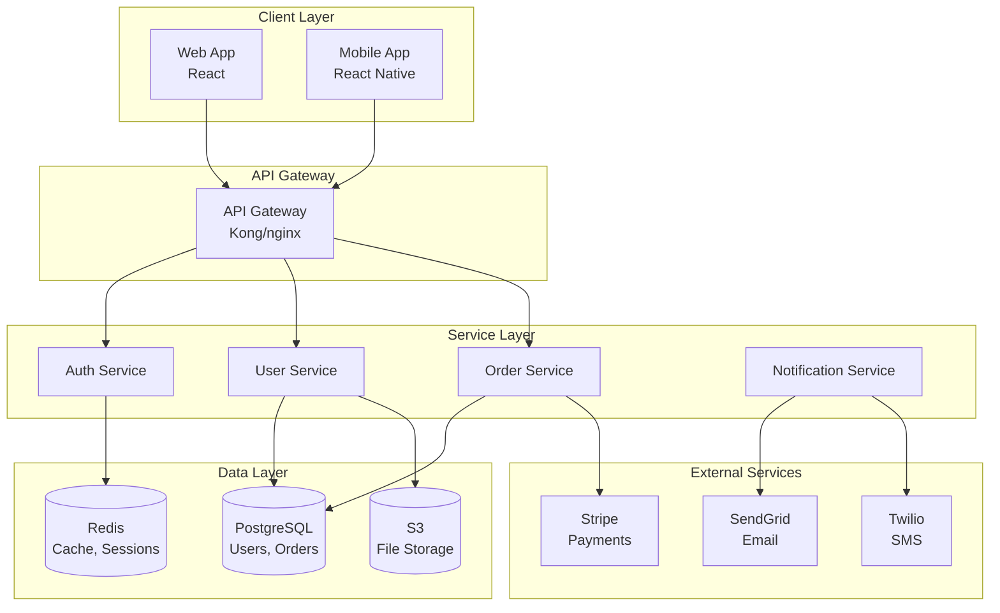
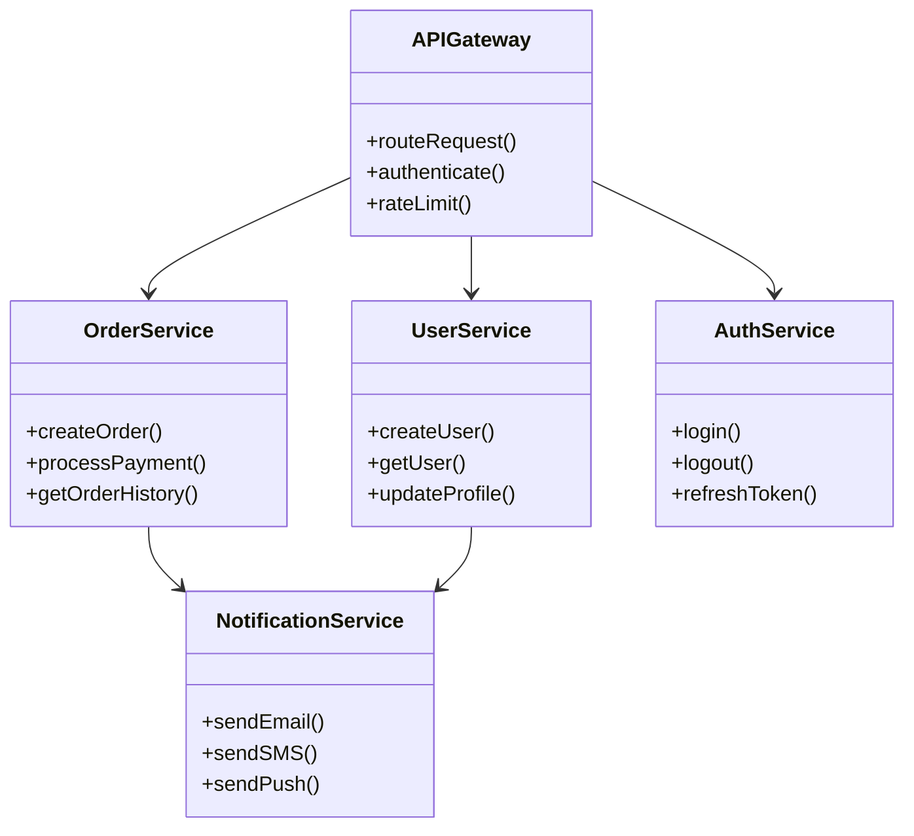
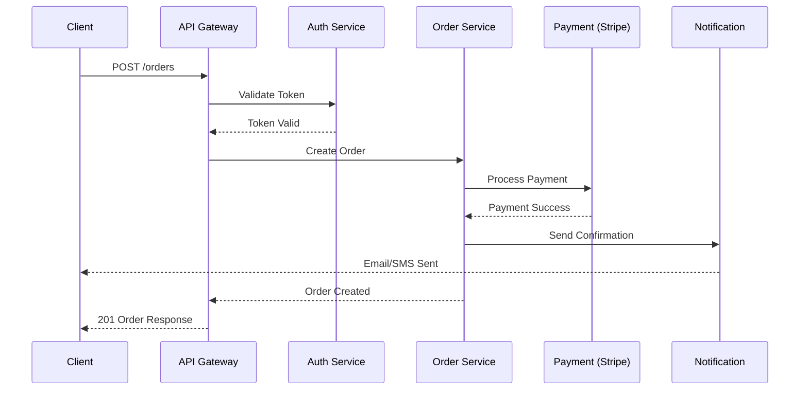

## Generate Architectural Diagram

**Objective:** Generate a clear and informative architectural diagram that visually represents the structure and components of the codebase, based on its actual structure and dependencies.

**Instructions:**

1. **Analyze the codebase:**  Examine the directory structure, modules, classes, and their relationships to understand the system's architecture. 
2. **Identify key components:** Determine the major building blocks of the system, such as:
    * User Interface components
    * APIs or services
    * Databases
    * External systems
    * Business logic modules
3. **Determine relationships:** Analyze how these components interact with each other. For example:
    * Which modules depend on others?
    * How do data flows between components?
    * What are the communication protocols used?
4. **Choose a suitable diagram type:** Select a diagram type that effectively represents the architecture. Common choices include:
    * Component diagrams
    * Layered architecture diagrams
    * Data flow diagrams 
5. **Generate the diagram:** Use a diagramming tool or library to create a visually appealing and informative diagram that includes:
    * Clearly labeled components
    * Well-defined relationships (e.g., arrows indicating data flow or dependencies)
    * A legend or key to explain symbols and notations

**Expected Output:** A visual representation of the codebase's architecture, either as an image file or in a text-based format that can be easily rendered (e.g., PlantUML, Mermaid). The diagram should be:

* **Accurate:** It should correctly reflect the actual structure and dependencies in the codebase.
* **Clear and Concise:** Avoid clutter and use concise labels for easy understanding.
* **Informative:** The diagram should convey the key architectural elements and their interactions effectively.

**Example Output:**

```markdown
## System Architecture Diagram

### High-Level Architecture Overview



### Component Diagram



### Data Flow Diagram



### Legend

| Symbol | Meaning |
|--------|---------|
| Rectangle | Service/Component |
| Cylinder | Database |
| Arrow | Data Flow / Dependency |
| Dashed Arrow | Async Communication |

### Architecture Notes

1. **API Gateway**: Single entry point handling auth, rate limiting, and routing
2. **Service Communication**: REST over HTTP for sync, RabbitMQ for async
3. **Database Strategy**: PostgreSQL for transactional data, Redis for caching
4. **External Integrations**: All external calls go through dedicated service adapters
```

**Techniques Used:**
- ST-01 (Clear Objective Statement) - Opens with clear diagram generation objective
- ST-02 (Structured Sequential Instructions) - Numbered steps for systematic diagram creation
- DT-02 (Specific Focus Areas with Examples) - Specific component categories (UI, APIs, databases, external systems)
- DS-05 (Visualization and Communication Guidance) - Comprehensive guidance for diagram types and visual representation
- DS-03 (Tool and Methodology Suggestions) - Recommends specific diagramming tools (PlantUML, Mermaid)
