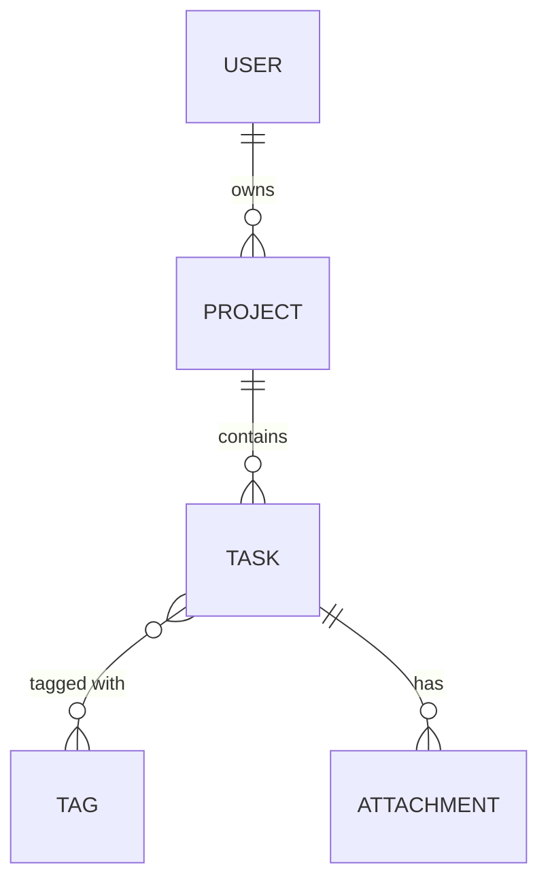

# Android Domain & Data Model Design

**Objective:** Design the app's domain and data model at planning time — produce a complete entity inventory with relationships, decide the single source of truth (SSOT) for each entity, route each piece of state to the right storage mechanism (Room, Preferences DataStore, Proto DataStore, in-memory, or remote-only), plan the *shape* of the Room schema (entities, keys, indices, relations, embedded objects, type converters) without writing the full DAO, choose an identity/key strategy that survives sync and process death, and define the mapping boundaries between domain models, persistence entities, and network DTOs.

**When to Use:** Use this prompt at the start of a greenfield Android project (or a major data-layer rewrite) once the architecture pattern is chosen but before any `@Entity`, DAO, or repository code exists. It is the bridge between "we picked Clean Architecture + MVVM" and "we are writing the data layer." Use it when you need to avoid the two most expensive Android data mistakes: choosing the wrong SSOT (forcing painful migrations later) and conflating domain models with Room entities and network DTOs (creating tight coupling that resists change).

**Sequence Map:**
- **Before this:** [`android_architecture_selection.md`](android_architecture_selection.md) (pick the layering and pattern)
- **This prompt:** Design the domain + data model shape
- **Alongside (if offline):** [`android_offline_first_architecture.md`](android_offline_first_architecture.md) (sync metadata feeds back into the schema)
- **After this:** [`../implementation/android_data_layer_implementation.md`](../implementation/android_data_layer_implementation.md) (implement DAOs, repositories, migrations)
- **Later review:** [`../targeted-reviews/android_room_database_query_review.md`](../targeted-reviews/android_room_database_query_review.md)

**Important context:** A domain model is *not* a Room entity, and a Room entity is *not* a network DTO — even when they look identical on day one. The single most valuable decision in this prompt is naming the SSOT per entity, because the SSOT determines who is allowed to write and which copy wins on conflict. The second is keeping these three model layers (domain / entity / DTO) distinct so that a backend field rename or a Room migration does not ripple into your UI. The trap to avoid is the inverse: over-engineering a three-model split with hand-written mappers for a 4-screen app with one entity. Match the model count to the project's actual change surface, which Context Gathering establishes first.

---

## Context Gathering

Ask these before designing. Do not assume — the answers change the storage routing and SSOT decisions materially.

1. **Domain scope and scale:**
   - "What are the core nouns of this app (the things users create, view, or act on)?"
   - "Roughly how many entity *types* (5? 20? 50+)? How many *rows* of the largest entity (hundreds? millions?)?"
   - "Which entities are user-generated vs. reference/config data that ships with or is fetched for the app?"

2. **Source of truth and connectivity:**
   - "Is this app online-required, offline-capable, or offline-first?" (If offline-first, run [`android_offline_first_architecture.md`](android_offline_first_architecture.md) in parallel — sync metadata becomes part of these entities.)
   - "Is the backend the authority for each entity, or does the device create authoritative data (e.g. local-only notes)?"
   - "Can two devices or two users edit the same record?"

3. **Identity and lifecycle:**
   - "Does the server assign IDs, or does the client need to create records before talking to the server?"
   - "Do records get hard-deleted, or do you need soft-delete / tombstones (for sync or undo)?"
   - "Which fields are immutable after creation vs. mutable?"

4. **Module and ownership:**
   - "Is the app modularized (e.g. `:core:database`, `:core:model`, `:feature:*`)? Which module owns the persistence layer?"
   - "Which features need to read each entity? Which need to write it?"

5. **Settings and small state:**
   - "What user preferences / app settings exist (theme, flags, last-selected-tab, onboarding-complete)?"
   - "Is there structured small state that isn't really a 'table' (e.g. a typed settings object, a draft)?"

---

## Instructions

### Phase 1: Domain Entity Inventory & Relationships

Enumerate every domain concept. Build an entity inventory table, then express relationships as an ER-style table or Mermaid diagram.

**Entity inventory:**

| Entity | Description | Owner module | Created by | Mutability | Approx. cardinality |
|--------|-------------|--------------|-----------|-----------|---------------------|
| `User` | Account profile | `:core:model` | Server | Mutable (profile fields) | 1 (self) + N (others) |
| `Project` | Top-level container | `:core:model` | Client + server | Mutable | 10s–100s |
| `Task` | Item inside a project | `:core:model` | Client | Mutable | 100s–1000s |
| `Tag` | Label applied to tasks | `:core:model` | Client | Immutable name | 10s |
| `Attachment` | File on a task | `:core:model` | Client | Immutable blob, mutable metadata | 100s |

**Relationships** — express as Mermaid so reviewers can see cardinality at a glance:



For each relationship record: cardinality (1:1, 1:N, N:M), whether it is **owning** (parent delete cascades to children) or **referencing** (child survives parent), and whether it crosses a module boundary.

**CHECKPOINT 1:** Confirm the entity list is complete and relationships are agreed before deciding storage. Adding an entity after schema design is cheap; restructuring relationships after the data layer is built is not.

---

### Phase 2: Single-Source-of-Truth (SSOT) Decision Per Entity

For each entity, name exactly one authoritative store. The SSOT answers "if local and remote disagree, who wins, and where does the UI read from?"

| Entity | SSOT | UI reads from | Writes go to | Conflict authority |
|--------|------|---------------|--------------|--------------------|
| `User` (self) | Room (cached from server) | Room (Flow) | Server, then Room | Server-wins |
| `Project` | Room (offline-first) | Room (Flow) | Room first, sync up | See offline-first prompt |
| `Task` | Room (offline-first) | Room (Flow) | Room first, sync up | Client-wins / field-merge |
| `Tag` | Server (reference data) | Room (cache) | Server only | Server-wins |
| `AppSettings` | Proto DataStore | DataStore (Flow) | DataStore | Device-local only |
| `AuthToken` | EncryptedDataStore / Keystore | In-memory + secure store | Secure store | N/A (device-local secret) |

**Rule:** The UI reads from the SSOT, never from two stores for the same entity. If the network can write a value the UI also reads, the network must write *through* the SSOT (Room), not beside it.

---

### Phase 3: Storage Routing Decision Table

Route each entity/state to a storage mechanism. Pick by *shape and access pattern*, not habit.

| Mechanism | Use for | Do NOT use for | 2026 default |
|-----------|---------|----------------|--------------|
| **Room (SQLite)** | Relational/queryable entities, lists, anything observed as `Flow<List<T>>`, large collections | Single scalar settings; secrets | Latest stable Room via the version catalog (KSP, Flow + coroutines, optional multiplatform) |
| **Proto DataStore** | Typed, structured app/user state (settings object, feature config) needing schema + defaults | Large or relational data; secrets | Preferred over SharedPreferences for structured state |
| **Preferences DataStore** | A handful of loose key/value flags (theme enum, onboarding-done boolean) | Anything with structure or relations | Replaces SharedPreferences entirely |
| **In-memory (StateFlow / cache)** | Ephemeral UI/session state, derived data, in-flight values | Anything that must survive process death | Hold in ViewModel / a singleton cache |
| **Encrypted store (Keystore-backed)** | Tokens, keys, PII secrets | Bulk data | Use a Keystore-backed mechanism; do not put secrets in plain Room/DataStore |
| **Remote-only (no local copy)** | Rarely-read, large, or privacy-sensitive data fetched on demand | Anything needed offline or on a hot path | Fetch + show, don't persist |

Produce a filled version of this table for the actual app. Justify any entity that lands in more than one store (it usually shouldn't).

**CHECKPOINT 2:** Every entity and every piece of state from Phases 1–2 must appear in exactly one SSOT row and one storage-routing row. Flag anything unrouted.

---

### Phase 4: Room Schema-Shape Planning (No Full DAO Yet)

Plan the *shape* of each Room entity. The deliverable is the entity skeleton + index/relation plan, **not** the full DAO — DAO authoring belongs to [`../implementation/android_data_layer_implementation.md`](../implementation/android_data_layer_implementation.md).

**Per-entity schema sheet:**

```kotlin
// SHAPE PLAN — Task entity (do not implement DAO here)
@Entity(
    tableName = "tasks",
    foreignKeys = [
        ForeignKey(
            entity = ProjectEntity::class,
            parentColumns = ["id"],
            childColumns = ["projectId"],
            onDelete = ForeignKey.CASCADE   // owning relationship from Phase 1
        )
    ],
    indices = [
        Index("projectId"),                 // FK columns must be indexed
        Index(value = ["projectId", "status"]) // composite: list query filter
    ]
)
data class TaskEntity(
    @PrimaryKey val id: String,             // identity strategy decided in Phase 5
    val projectId: String,
    val title: String,
    val status: TaskStatus,                 // needs a type converter (enum)
    val dueAt: Long?,                       // epoch millis, nullable
    @Embedded(prefix = "audit_") val audit: AuditInfo, // embedded value object
    val createdAt: Long,
    val updatedAt: Long
    // sync metadata (syncStatus, serverUpdatedAt, isDeleted) added here
    // ONLY if offline-first — see android_offline_first_architecture.md
)
```

Decide and record, per entity:

| Decision | Options | Guidance |
|----------|---------|----------|
| **Primary key** | `String` UUID / `Long` autogen / server ID | See Phase 5 |
| **Indices** | Single / composite | Index every FK; index columns used in `WHERE`/`ORDER BY` of planned list queries |
| **Relations** | `@Embedded` vs `@Relation` | `@Embedded` for value objects owned 1:1; `@Relation` for queried 1:N/N:M (read-only POJOs) |
| **N:M join** | Junction entity | Model `Task`↔`Tag` as an explicit `TaskTagCrossRef` entity with a composite PK |
| **Type converters** | Per type | Enums, `Instant`/dates (store epoch `Long`), small value objects; avoid converting large blobs |
| **Embedded vs separate table** | By query need | Embed if always read together and never queried independently; separate table if queried/filtered on its own |

**Anti-pattern to call out:** Do not store JSON blobs in a column to dodge schema design — it defeats indexing, querying, and migrations. Reserve JSON-in-a-column only for genuinely opaque payloads (e.g. a sync queue entry).

---

### Phase 5: Identity & Key Strategy

Identity is the decision most likely to force a painful migration. Choose per entity and write down the reconciliation rule.

| Strategy | When to use | Reconciliation concern |
|----------|-------------|------------------------|
| **Local autogen `Long`** | Device-only entities never synced to a server | None; never expose to API |
| **Server-assigned ID** | Online-required apps where records are created server-side | Cannot create a row before the server responds (no offline create) |
| **Client UUID (`String`)** | Offline-first; client must create before sync | Server must accept client-provided IDs, or you map local↔server IDs |

**Reconciliation rule (offline-first):** If the client mints a UUID and the server also assigns an ID, decide one of: (a) server accepts the client UUID as the canonical PK (preferred — no remapping), or (b) keep a `serverId` column and an explicit local↔server ID map. Never mutate a Room `@PrimaryKey` after rows reference it via foreign keys — add a `serverId` column instead.

Record for each entity: the PK type, who mints it, whether a separate `serverId` exists, and the rule for matching a local row to an incoming server row.

---

### Phase 6: Denormalization for Offline Read Performance

Offline-first apps read from Room on the UI hot path, so optimize for reads. Decide deliberate denormalizations.

| Denormalization | Benefit | Cost |
|-----------------|---------|------|
| Store `projectName` on `TaskEntity` | List renders without a join | Must update on project rename |
| Store `tagCount` on `TaskEntity` | Avoid `COUNT` per row | Must maintain on tag add/remove |
| Cache computed `displayDate` | Skip per-frame formatting | Recompute on locale/timezone change |

Rule: denormalize only fields on a measured hot path; document the write that keeps each denormalized field consistent. Default to normalized + `@Relation`; denormalize as an optimization with evidence, not by default.

---

### Phase 7: Data Ownership Across Modules

If modularized, assign ownership so dependencies stay acyclic.

| Concern | Lives in | Rule |
|---------|----------|------|
| Domain models (pure Kotlin data classes) | `:core:model` | No Android/Room imports; depended on by everyone |
| Room entities + DAOs + DB | `:core:database` | Depends on `:core:model`; never depended on by `:feature:*` directly |
| DataStore wrappers | `:core:datastore` | Owns settings serialization |
| Repository interfaces | `:core:data` (or feature) | Features depend on interfaces, not Room |

Feature modules depend on repository interfaces and domain models — never on Room entities. This keeps a schema change inside `:core:database`. (See [`android_modularization_strategy.md`](android_modularization_strategy.md).)

---

### Phase 8: Model Mapping (Domain ↔ Entity ↔ DTO)

Decide how many model layers this app actually needs, then define mappers at each boundary.

| Project shape | Recommended layers | Rationale |
|---------------|--------------------|-----------|
| Tiny app, one data source, stable backend | **1 model** (entity == domain) | Three-layer split is over-engineering here |
| Typical app, backend you don't control | **3 models** (DTO → Entity → Domain) | Insulate UI from API renames and migrations |
| Backend stable but local-only | **2 models** (Entity → Domain) | No DTO needed |

For the 3-model case, define mapper direction explicitly:

```
Network DTO  --(toEntity)-->  Room Entity  --(toDomain)-->  Domain Model  --> UI
Domain Model --(toEntity)-->  Room Entity  --(toDto)----->  Network DTO   --> API
```

Record which fields are dropped or transformed at each boundary (e.g. DTO has `server_updated_at` the domain model never sees; domain has a computed `isOverdue` no store persists).

**CHECKPOINT 3:** Confirm the chosen model-layer count matches the project's change surface from Context Gathering. Do not ship hand-written mappers and three model layers for a one-entity app.

---

### Phase 9: Migration-Readiness Intent

You are not writing migrations yet, but record intent so the implementation phase can honor it.

- **Schema version:** Start at `version = 1`; commit to exporting schemas (`room.schemaLocation`) from day one so migrations are testable.
- **Additive-first policy:** Plan changes as additive (new nullable columns/tables) where possible; reserve destructive migrations for explicit, tested cases.
- **Soft-delete intent:** If sync needs tombstones, reserve `isDeleted` now rather than retrofitting it.
- **No `fallbackToDestructiveMigration()` in production:** Note this as a hard rule for the implementation phase.

---

## Expected Output

1. **Domain Entity Inventory** — table of every entity with owner module, creator, mutability, cardinality.
2. **Relationship Model** — ER-style table or Mermaid `erDiagram` with cardinality and owning/referencing flags.
3. **SSOT Decision Table** — one authoritative store per entity, with UI-read and write-path columns.
4. **Storage Routing Table** — every entity/state mapped to exactly one storage mechanism, with justification.
5. **Room Schema-Shape Sheets** — per-entity skeletons (keys, indices, relations, embedded, converters); no full DAOs.
6. **Identity & Key Strategy** — PK type and reconciliation rule per entity.
7. **Denormalization Register** — deliberate denormalizations with their maintenance writes.
8. **Module Ownership Map** — which module owns models, entities, DataStore, repositories.
9. **Model Mapping Plan** — chosen layer count + mapper directions and dropped/transformed fields.
10. **Migration-Readiness Notes** — versioning, schema export, additive policy, soft-delete reservations.

---

## CRITICAL: Verification Requirements

- [ ] Every entity has exactly one named SSOT (no entity read from two stores)
- [ ] Every entity and piece of state is routed to exactly one storage mechanism
- [ ] Storage routing matches access shape (relational → Room; structured settings → Proto DataStore; loose flags → Preferences DataStore; secrets → Keystore-backed store)
- [ ] Every foreign-key column has an index in the schema-shape plan
- [ ] N:M relationships are modeled with an explicit junction entity, not a JSON column
- [ ] Identity strategy is decided per entity, with a reconciliation rule for any synced entity
- [ ] Primary keys are never planned to mutate after FKs reference them (use `serverId` instead)
- [ ] Model-layer count matches the project's change surface (no gratuitous 3-layer split for a trivial app)
- [ ] No secrets routed to plain Room or DataStore
- [ ] Schema export + additive-first migration intent recorded; no `fallbackToDestructiveMigration()` in production
- [ ] No full DAO/repository code written here (deferred to the implementation prompt)

---

## False-Positive Prevention

- ❌ "Use three models (DTO/Entity/Domain) with mappers everywhere." → ✅ Match layers to change surface: a one-entity, stable-backend app may correctly use a single model; reserve the 3-layer split for apps with a backend you don't control.
- ❌ "Put everything in Room — it's the database." → ✅ Route by shape: settings go to DataStore, secrets to a Keystore-backed store, ephemeral state stays in-memory. Room is for queryable/relational/observed collections.
- ❌ "Store the related objects as a JSON string column to avoid joins." → ✅ Model relations properly with `@Relation`/junction entities; JSON-in-column defeats indexing, querying, and migrations and is reserved for opaque payloads.
- ❌ "Use the server ID as the primary key everywhere." → ✅ Only if the app is online-required; an offline-first app needs client-minted UUIDs (or a `serverId` column) so records exist before sync.
- ❌ "Denormalize aggressively for speed." → ✅ Denormalize only on a measured hot path and document the write that keeps each copy consistent; default to normalized.
- ❌ "Reach into Room entities directly from the feature module." → ✅ Features depend on repository interfaces and domain models; Room entities stay inside the database module.
- ❌ "We'll use `fallbackToDestructiveMigration()` for now." → ✅ Plan additive migrations and export schemas from version 1; destructive fallback wipes user data in production.

---

## Techniques Used

- **ST-01 (Clear Objective Statement):** Opens with an explicit objective defining the planning-time deliverable (model design, not implementation).
- **ST-02 (Structured Sequential Instructions):** Nine ordered phases from entity inventory through migration-readiness, executable in sequence.
- **RT-02 (Multi-Dimensional Analysis Framework):** Each storage/identity/mapping decision is evaluated across multiple dimensions (access shape, SSOT, sync, module ownership, change surface) rather than one axis.
- **RT-05 (Evidence-Based Reasoning):** Denormalization and model-layer decisions require measured hot-path / change-surface evidence, not preference.
- **DS-06 (Prioritization and Severity Guidance):** CHECKPOINT gates force the highest-leverage decisions (entity completeness, SSOT, model-layer count) to be settled before lower-stakes detail.
- **CM-01 (Explicit Context Framing):** The "Important context" framing and Context Gathering establish SSOT/connectivity/scale before any modeling.

## Related Prompts

- [`android_architecture_selection.md`](android_architecture_selection.md) — choose the architecture pattern that this model plugs into (run first)
- [`android_offline_first_architecture.md`](android_offline_first_architecture.md) — sync metadata and conflict authority that feed back into these entities
- [`../implementation/android_data_layer_implementation.md`](../implementation/android_data_layer_implementation.md) — implement the DAOs, repositories, and migrations from this design
- [`../targeted-reviews/android_room_database_query_review.md`](../targeted-reviews/android_room_database_query_review.md) — review the resulting Room schema and queries
- [`android_modularization_strategy.md`](android_modularization_strategy.md) — module boundaries referenced by the ownership map
