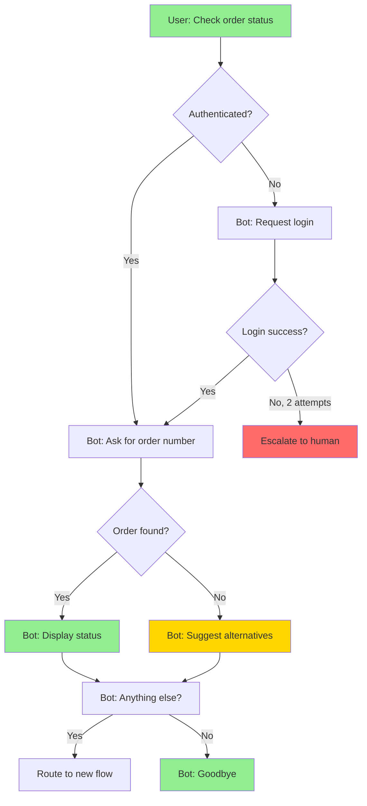

# Chatbot Conversation Flow Design

**Objective:** Design comprehensive conversation flows for a chatbot, mapping happy paths, edge cases, error recovery branches, escalation triggers, and conversation endings. Produces visual flow diagrams in Mermaid notation.

**When to Use:**
- Use when: Designing a new chatbot's conversation architecture
- Use when: Expanding an existing bot with new conversation paths
- Use when: Documenting conversation flows for handoff to developers
- Use when: Reviewing flows for completeness before implementation
- Don't use when: Defining the NLU model (use `dialog_architecture_intent_taxonomy.md`)

## Instructions

1. **Map User Goals and Entry Points**
   - List all user goals the chatbot should support
   - Identify entry points: greeting, deep link, proactive notification, mid-flow redirect
   - Determine which goals are self-service vs require human handoff
   - Prioritize goals by frequency and business impact

2. **Design Happy Path Flows**
   For each user goal:
   - Map the ideal conversation from trigger to resolution
   - Identify each system turn (question, confirmation, result)
   - Identify each user turn (expected input types)
   - Mark decision points where the flow branches
   - Keep happy paths to under 5 turns where possible

3. **Map Edge Cases and Branches**
   For each decision point:
   - What happens if the user provides unexpected input?
   - What if required information is missing?
   - What if the user changes their mind mid-flow?
   - What if external system calls fail?
   - What if the user asks an off-topic question during a flow?

4. **Design Error Recovery**
   - **Clarification loops**: Maximum 2 attempts before offering alternatives
   - **Graceful degradation**: When bot can't help, what's the fallback?
   - **Context preservation**: If user gets off track, can they resume?
   - **Escape hatches**: User can always say "start over" or "talk to a human"

5. **Define Escalation Triggers**
   - Sentiment-based: Detected frustration or anger
   - Failure-based: 3+ consecutive misunderstandings
   - Complexity-based: Request exceeds bot capability
   - User-requested: Explicit "talk to a human"
   - Business rule: High-value transactions, complaints

6. **Design Conversation Endings**
   - Successful resolution: Summarize what was done, ask if anything else
   - Partial resolution: Explain what was accomplished, what remains
   - Handoff: Warm transfer with context summary for human agent
   - Abandonment: Graceful timeout, save progress for return
   - Satisfaction check: Optional CSAT micro-survey

7. **Generate Mermaid Flow Diagrams**
   - Create one diagram per major flow
   - Color-code: Green (happy path), Yellow (edge case), Red (error/escalation)
   - Include all decision nodes and transition labels
   - Mark human handoff points clearly

8. **CRITICAL: Validate flow completeness**
   - Walk through every path end-to-end
   - Verify no dead ends exist (every state has an exit)
   - Check that escalation is reachable from every state
   - Ensure context is passed correctly at handoff points
   - **Confidence**: High (tested with user scenarios), Medium (designed), Low (placeholder)

## False-Positive Prevention (MUST follow)

- **DON'T** design flows that trap users in loops with no escape
- **DON'T** add more than 3 clarification attempts before escalating
- **DON'T** lose conversation context during error recovery
- **DON'T** design flows longer than 7 turns for simple tasks
- **DO** always provide a "talk to human" escape hatch
- **DO** preserve user-provided information across error recovery
- **DO** test flows with the most confused user you can imagine

## Expected Output

```markdown
## Conversation Flows: [Bot Name]

### Flow Overview
| Flow | Goal | Turns (happy) | Escalation Points |
|------|------|---------------|-------------------|
| Order Status | Check order | 3 | Auth failure, order not found |

### Flow: [Flow Name]
**Trigger:** [How user enters this flow]
**Happy Path Turns:** [Count]
**Resolution:** [What success looks like]

#### Mermaid Diagram


#### Turn-by-Turn Script
| Turn | Actor | Message | Notes |
|------|-------|---------|-------|
| 1 | User | "Where's my order?" | Triggers OrderStatus intent |
| 2 | Bot | "I can help with that. What's your order number?" | Slot: order_id |
| 3 | User | "12345" | Slot filled |
| 4 | Bot | "Your order #12345 shipped yesterday and arrives Friday." | Resolution |

#### Edge Cases
| Case | Handling |
|------|----------|
| Invalid order number | "That doesn't look like an order number. It usually starts with..." |
| Multiple orders | "I found 3 orders. Which one?" + list |
```

## Techniques Used

- **ST-01 (Clear Objective Statement):** Comprehensive flow design
- **ST-02 (Structured Sequential Instructions):** Goals → happy paths → edges → errors → endings
- **RT-02 (Multi-Dimensional Analysis):** Coverage across paths, errors, escalation
- **OC-03 (Structured Output):** Mermaid diagrams + turn-by-turn scripts
- **DS-06 (Prioritization Guidance):** Flows prioritized by frequency and impact

## Customization Guide

- **For E-commerce**: Add order, return, payment, and shipping flows
- **For SaaS Support**: Add account, billing, technical troubleshooting flows
- **For Healthcare**: Add appointment, prescription, symptom checking flows (with safety disclaimers)
- **For Banking**: Add balance, transfer, dispute flows (with authentication requirements)
