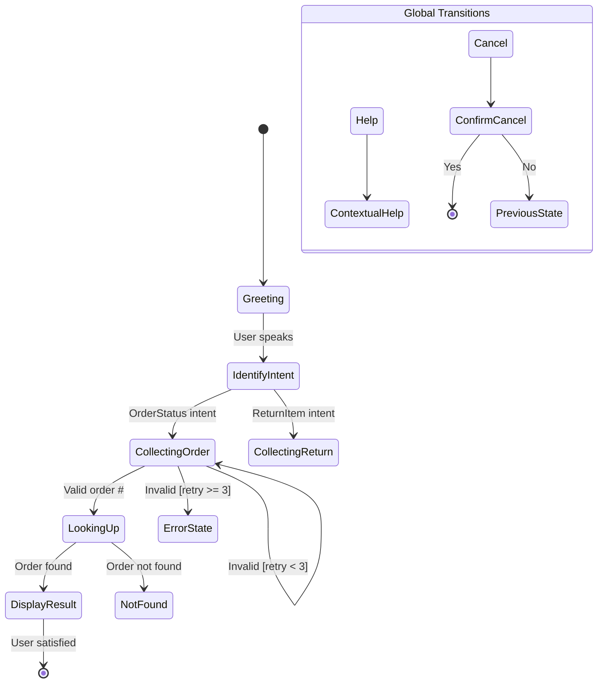

# Dialog State Machine Design

**Objective:** Design a dialog state machine for a conversational application, producing a complete specification of states, transitions, guards, and actions. Covers finite-state, frame-based, and hybrid approaches with implementation patterns.

**When to Use:**
- Use when: Building a structured conversation system with defined paths
- Use when: Migrating ad-hoc dialog logic to a formal state machine
- Use when: Debugging conversation flows that get "stuck" or behave unexpectedly
- Use when: Documenting dialog management for development handoff
- Don't use when: Building a purely LLM-driven freeform conversation (use `chatbot_design_llm_powered_architecture.md`)

## Instructions

1. **Select Dialog Management Approach**
   Evaluate and choose:
   - **Finite-State**: Fixed paths, simple branching (best for IVR, simple tasks)
   - **Frame-Based**: Slot-filling with flexible order (best for form completion)
   - **Plan-Based**: Goal-driven with dynamic planning (best for complex tasks)
   - **Hybrid**: Combine approaches for different parts of the conversation
   Document the rationale for the chosen approach.

2. **Define Dialog States**
   For each state, specify:
   - **State name**: Descriptive, using verb-noun convention (e.g., CollectingDestination)
   - **State type**: Initial, intermediate, terminal, error
   - **Entry actions**: What happens when entering this state (e.g., prompt user)
   - **Expected inputs**: What user inputs are valid in this state
   - **State data**: What information is tracked in this state
   - **Timeout behavior**: What happens if no input is received

3. **Map Transitions**
   For each transition:
   - **Source state**: Where the transition starts
   - **Target state**: Where it leads
   - **Trigger**: What causes the transition (user input, system event, timeout)
   - **Guard conditions**: What must be true for the transition to fire
   - **Actions**: Side effects during the transition (API calls, data storage)

4. **Design Guard Conditions**
   - Authentication guards: Is user verified?
   - Data completeness guards: Are required slots filled?
   - Business rule guards: Does the request meet business constraints?
   - Context guards: Is this transition valid given conversation history?
   - Compound guards: Multiple conditions combined with AND/OR logic

5. **Handle Cross-Cutting Concerns**
   - **Global intents**: Help, cancel, start-over available from any state
   - **Context stack**: Push/pop for conversational detours (e.g., mid-flow questions)
   - **State persistence**: How to save and restore dialog state across sessions
   - **Error states**: Global error handling vs state-specific error handling
   - **Logging**: What to log at each state transition for debugging

6. **Create State Diagram**
   - Produce a Mermaid stateDiagram-v2 showing all states and transitions
   - Color-code states by type (initial, happy path, error, terminal)
   - Label transitions with triggers and guard conditions
   - Mark global transitions (available from any state) distinctly

7. **CRITICAL: Validate the state machine**
   - Verify no unreachable states exist
   - Check that every state has at least one exit transition
   - Ensure no infinite loops without exit conditions
   - Test that global intents (help, cancel) work from every state
   - Verify error recovery returns to the correct state
   - **Confidence**: High (formally verified), Medium (manually traced), Low (draft)

## False-Positive Prevention (MUST follow)

- **DON'T** over-specify states for simple conversations (avoid state explosion)
- **DON'T** make every field a separate state (use frame-based for forms)
- **DON'T** forget global transitions (help, cancel must always work)
- **DON'T** ignore the state persistence problem for long-running conversations
- **DO** use composite states to reduce complexity
- **DO** test with pathological user inputs (random state jumping)
- **DO** document the "why" behind each guard condition

## Expected Output

```markdown
## Dialog State Machine: [Application Name]

### Approach
**Primary:** [Finite-State / Frame-Based / Hybrid]
**Rationale:** [Why this approach]

### State Inventory
| State | Type | Entry Action | Expected Inputs | Timeout |
|-------|------|-------------|-----------------|---------|
| Greeting | Initial | Send welcome | Any intent | 30s → re-prompt |
| CollectingOrder | Intermediate | Ask for order # | Order number, help, cancel | 15s → re-prompt |
| Confirmed | Terminal | Send confirmation | - | - |

### State Diagram


### Transition Table
| From | To | Trigger | Guard | Action |
|------|----|---------|-------|--------|
| Greeting | IdentifyIntent | User input | None | Classify intent |
| CollectingOrder | LookingUp | Order # provided | Valid format | Call order API |

### Cross-Cutting Concerns
| Concern | Strategy |
|---------|----------|
| Help | Context-aware: shows help for current state |
| Cancel | Confirm first, then return to start |
| Persistence | Redis-backed session store, 24h TTL |
```

## Techniques Used

- **ST-01 (Clear Objective Statement):** State machine design for dialog
- **ST-02 (Structured Sequential Instructions):** Approach → states → transitions → guards → validation
- **RT-02 (Multi-Dimensional Analysis):** States, transitions, guards, cross-cutting
- **OC-03 (Structured Output):** State diagrams + transition tables
- **CM-01 (Explicit Context Framing):** Dialog-specific constraints

## Customization Guide

- **For IVR Systems**: Finite-state with DTMF inputs, simpler branching
- **For Task-Oriented Bots**: Frame-based with slot filling focus
- **For Complex Assistants**: Hybrid with LLM for open-ended, state machine for structured
- **For Multi-intent Sessions**: Stack-based state management for conversation threading
