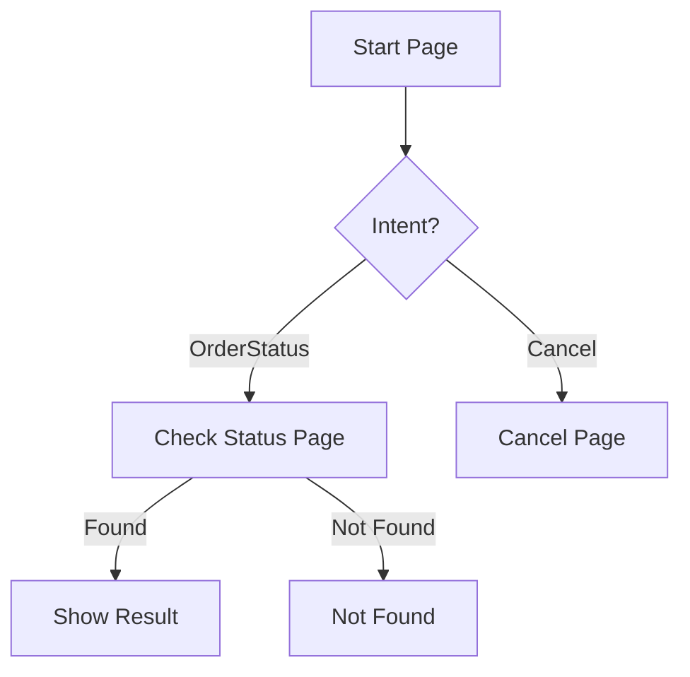

# Dialogflow Agent Design and Review

**Objective:** Design or review a Dialogflow CX or ES agent, producing specifications for agent architecture, page/flow design (CX) or context management (ES), webhook fulfillment patterns, entity management, environment promotion, and Google Cloud service integration.

**When to Use:**
- Use when: Building a new Dialogflow-based conversational agent
- Use when: Migrating from Dialogflow ES to CX
- Use when: Reviewing an existing agent for architectural improvements
- Use when: Integrating Dialogflow with Google Cloud services (Cloud Functions, BigQuery)
- Don't use when: Building on Alexa (use `platform_alexa_skill_development.md`)

## Instructions

1. **Choose Platform Version**
   - **Dialogflow ES (Essentials)**: Intent-based, simpler, good for small bots
   - **Dialogflow CX**: Flow-based, enterprise-ready, better for complex conversations
   Document the rationale for the choice.

2. **Design Agent Architecture (CX)**
   If using Dialogflow CX:
   - **Flows**: Top-level conversation modules (one per major feature)
   - **Pages**: States within a flow (equivalent to dialog states)
   - **Routes**: Transitions between pages based on intents or conditions
   - **Transition route groups**: Shared routes across multiple pages
   - **State handlers**: Entry fulfillment, event handlers
   - **Parameters**: Session-scoped data storage

3. **Design Agent Architecture (ES)**
   If using Dialogflow ES:
   - **Intents**: Core intent design with training phrases
   - **Contexts**: Input/output contexts for multi-turn management
   - **Context lifespan**: How long contexts persist (default 5 turns)
   - **Follow-up intents**: For structured conversation trees
   - **Slot filling**: Required parameters with prompts

4. **Configure Webhook Fulfillment**
   - Webhook endpoint design (Cloud Functions, Cloud Run, external)
   - Request/response format handling
   - Session parameter management via webhook
   - Conditional fulfillment: when to call webhook vs static response
   - Error handling: Timeout (5s default), retry policy, fallback responses
   - Authentication between Dialogflow and webhook

5. **Design Entity Management**
   - System entities: Use @sys.date, @sys.number, @sys.geo-city, etc.
   - Custom entities: Developer entities with synonyms and auto-expansion
   - Session entities: Per-session dynamic entities
   - Composite entities: Combining multiple entities
   - Regexp entities: Pattern-based extraction
   - Entity fuzzy matching configuration

6. **Plan Environment and Version Management**
   - Draft environment for development
   - Staging environment for testing
   - Production environment for live traffic
   - Version management: Creating versions, rollback strategy
   - Testing before promotion: Test cases, validation
   - CI/CD: Exporting/importing agents programmatically

7. **Integrate with Google Cloud**
   - Cloud Functions for webhook fulfillment
   - BigQuery for conversation analytics
   - Cloud Storage for media and documents
   - Secret Manager for API keys
   - Cloud Logging for debugging
   - IAM for access control

8. **CRITICAL: Validate agent design**
   - Run built-in test cases for all flows/intents
   - Test with the simulator across all supported channels
   - Verify webhook reliability under load
   - Check entity recognition accuracy with edge cases
   - Test environment promotion doesn't break production
   - **Confidence**: High (tested end-to-end), Medium (simulator tested), Low (designed only)

## False-Positive Prevention (MUST follow)

- **DON'T** use Dialogflow ES for complex multi-flow conversations (use CX)
- **DON'T** rely solely on contexts for state management in ES (fragile)
- **DON'T** put business logic in fulfillment inline editor (not scalable)
- **DON'T** skip environment staging (don't push directly to production)
- **DO** use transition route groups for shared navigation (Help, Cancel)
- **DO** set appropriate context lifespans (don't leave them at default forever)
- **DO** implement webhook timeout handling

## Expected Output

```markdown
## Dialogflow Agent Design: [Agent Name]

### Platform: Dialogflow [CX / ES]
**Rationale:** [Why this version]

### Architecture (CX)
| Flow | Pages | Purpose |
|------|-------|---------|
| Default Start | Welcome, Route | Entry point and intent routing |
| Order Management | Check Status, Cancel, Modify | Order-related tasks |
| Account | Login, Profile, Settings | Account management |

### Flow: [Flow Name]


### Webhook Design
| Endpoint | Trigger | Response Time Target |
|----------|---------|---------------------|
| /order-status | OrderStatus intent | <3s |
| /cancel-order | CancelOrder intent | <3s |

### Entity Schema
| Entity | Type | Auto-Expansion | Fuzzy Match |
|--------|------|----------------|-------------|
| @order_number | Regexp | No | No |
| @product_category | Custom | Yes | Yes |

### Environment Strategy
| Environment | Purpose | Promotion Path |
|-------------|---------|---------------|
| Draft | Development | Manual → Staging |
| Staging | QA testing | Approved → Production |
| Production | Live traffic | Versioned, rollback-ready |
```

## Techniques Used

- **ST-01 (Clear Objective Statement):** Dialogflow agent design/review
- **ST-02 (Structured Sequential Instructions):** Platform → architecture → webhook → entities → environments
- **RT-02 (Multi-Dimensional Analysis):** Flows, webhooks, entities, environments
- **CM-01 (Explicit Context Framing):** Dialogflow platform constraints
- **DS-06 (Prioritization Guidance):** CX vs ES decision, migration priority

## Customization Guide

- **For ES → CX Migration**: Map contexts to CX pages, follow-ups to routes
- **For Telephony**: Add DTMF handling, SIP integration, telephony-specific parameters
- **For Omnichannel**: Configure channel-specific rich messages (web, Messenger, WhatsApp)
- **For Multi-Language**: Agent per language vs single agent with language detection
